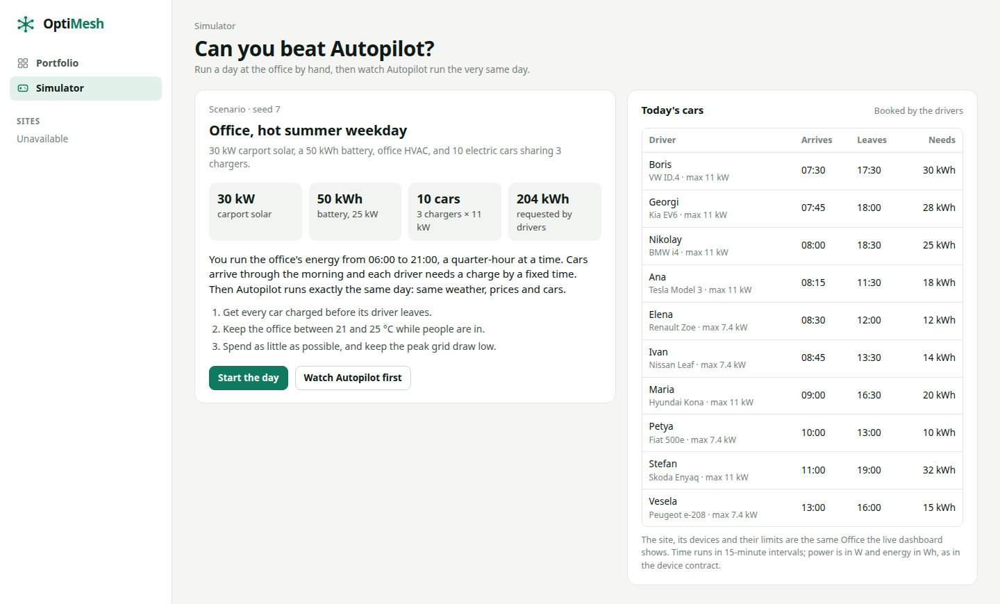
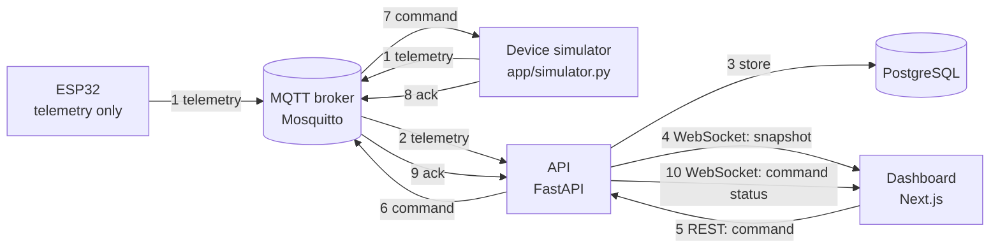

# OptiMesh

**Connect. Predict. Optimize.**

OptiMesh is an energy autopilot for one site (a home, a workshop or an office): it measures every device, forecasts sun and price, and plans when each device runs.

[](https://github.com/Praz40/OptiMesh/actions/workflows/ci.yml?query=branch%3Amain)

This README is in English apart from the short Bulgarian summary below; the demo runbook [docs/DEMO.md](docs/DEMO.md) and the project report [docs/REPORT.md](docs/REPORT.md) are in Bulgarian.

## Накратко (на български)

OptiMesh свързва устройствата на един обект чрез общ MQTT договор, показва живите им измервания в табло и изпраща команди, които стават „Приложено“ едва след потвърждение от устройството. Бекендът прогнозира слънцето, товара и цената за следващите 24 часа, а Autopilot (засега само в симулация) решава кога да се зареждат колите и батерията. В един симулиран офисен ден с борсовите цени за България от 30.09.2026 Autopilot сваля разхода от 27,77 на 18,24 EUR и зарежда навреме и 10-те коли; това е симулация с допуснати товари и коли, а не измерване на реален обект.

## What it does

The demo has three acts.

**1. Connect.** Devices (an ESP32 or the device simulator) send telemetry over MQTT in one shared contract, and the dashboard shows every site live over a WebSocket.
Switch the site to „Асистент“ mode (by default every site opens in „Наблюдение“, which is read-only), flip a switch on the dashboard and the command travels back to the device; the log says „Приложено“ only after the device acknowledges it.


**2. Predict.** For each site the API forecasts the next 24 hours of solar, load and price, prices today's grid energy and proposes commands (`/forecast`, `/costs`, `/recommendations`).
Every forecast lists its assumptions. The dashboard shows the forecast and today's costs with their assumptions in the „Прогноза“ and „Разходи“ tabs and the recommendations in „Асистент“ mode; the raw responses are in the API docs at http://127.0.0.1:8000/docs.


**3. Optimize.** In the `/simulator` game you run an office day by hand (10 cars, 3 chargers, a battery and solar), then Autopilot runs the very same day and the results compare cost, peak and cars charged.
In the terminal, a linear-programming Autopilot plans an office day on real day-ahead prices; its numbers are under [Results](#results).



## Architecture



Steps 1–4 carry measurements to the dashboard; steps 5–10 carry a command back and its acknowledgement. The ESP32 firmware does not accept commands yet, so the device simulator closes the return path. Telemetry can also arrive over HTTP (`POST /api/v1/telemetry`). The scenario simulator and the `/simulator` game run in memory and use none of this.

- **Dashboard** (`apps/web`): Next.js 16 (App Router), React 19, TypeScript, Tailwind CSS 4, vitest.
- **API** (`services/api`): Python 3.12, FastAPI, SQLAlchemy, Alembic, psycopg, Pydantic, aiomqtt, PyJWT; dependencies managed with uv.
- **Autopilot** (`services/api/app/sim`): NumPy and SciPy `linprog` with the HiGHS solver.
- **Database**: PostgreSQL 17 locally (Docker Compose, or the setup in [appendix A of docs/DEMO.md](docs/DEMO.md#приложение-а-без-docker)) and in CI; Supabase when hosted.
- **Broker**: Mosquitto 2, anonymous and bound to localhost for development; TLS with backend credentials on a Raspberry Pi for hardware.
- **Firmware** (`firmware/esp32-telemetry`): ESP-IDF through PlatformIO (`espressif32@6.9.0`), MQTT over TLS.
- **CI**: GitHub Actions, `frontend` and `backend` jobs on every push to `main`, `develop`, `feature/**`, `release/**` and `hotfix/**`, and on every pull request into `develop`, `main`, `release/**` and `hotfix/**`.

## What works now

- **One device contract (v1)**: telemetry, commands and acknowledgements over MQTT. The hardware-facing spec is [docs/contracts.md](docs/contracts.md); JSON Schemas and examples are in `contracts/`. Telemetry ingestion is idempotent per `message_id`, over MQTT or `POST /api/v1/telemetry`.
- **Live loop in both directions**: the MQTT bridge stores telemetry in PostgreSQL and streams a snapshot of each site over `/api/v1/sites/{site_id}/live`. Commands are validated against the device's capabilities and limits and go `pending → sent → applied / rejected / expired / failed`; only the device's acknowledgement makes a command `applied`.
- **MQTT over verified TLS** for the Raspberry Pi broker; plain MQTT is accepted only for an anonymous local broker. See [docs/raspberry-pi-mqtt.md](docs/raspberry-pi-mqtt.md).
- **Forecast, costs and recommendations** (API with Bulgarian texts, shown in the „Прогноза“ and „Разходи“ tabs and in „Асистент“ mode):
  - `GET /api/v1/sites/{site_id}/forecast`: the next 24 hours, hourly: expected solar (clear-sky curve × installed inverter capacity × 0.85), load (the past week's average at that hour, or the current consumption) and import/export prices, with the assumptions listed.
  - `GET /api/v1/sites/{site_id}/costs`: today's energy cost at the grid meter (local day), from interval energy.
  - `GET /api/v1/sites/{site_id}/recommendations`: up to five proposed commands with the reason and a rough saving. Nothing is sent; applying one goes through `POST /api/v1/sites/{site_id}/devices/{device_id}/commands`.
- **Dashboard**: a Portfolio („Портфолио“) of all sites; per site an Overview („Преглед“: KPI tiles, animated energy flow, plain-language insights, power chart, flexible devices with switch and power-limit controls, recent commands), a Devices page („Устройства“) and an Activity page („Активност“) with the command history.
- **Forecast tab** („Прогноза“, `/sites/{site_id}/forecast`): expected solar and load for the next 24 hours on one chart and import/export prices on a separate step chart, marked as a forecast and listing the API's assumptions.
- **Costs tab** („Разходи“, `/sites/{site_id}/costs`): today's cost so far at the grid meter, energy imported and exported, the projected day cost and an hourly table with the assumptions, plus a „Разход в момента“ tile on the Overview (grid power × this hour's price).
- **Monitor and Assist modes** (site header, remembered per site in the browser): „Наблюдение“ is read-only and the default; „Асистент“ lists the API's recommendations, sends one only on „Приложи“ and follows it to `applied`, `rejected`, `expired` or `failed`; „Автопилот“ is shown but disabled for real sites.
- **`/simulator` game**: an office day by hand, then the same day with a rule-based Autopilot, compared on cost, peak and cars charged. It runs in the browser and needs no backend.
- **Scenario simulator and Autopilot** (`services/api/app/sim`): a deterministic office day (10 EVs, 3 chargers, battery, solar, Bulgarian day-ahead prices) and a rolling-horizon linear-programming scheduler. See [Results](#results).
- **Device simulator** (`python -m app.simulator`): virtual devices for the demo sites, speaking the same MQTT contract as hardware; `--include-hardware` also stands in for the ESP32.
- **ESP32 firmware** (`firmware/esp32-telemetry`): publishes telemetry over TLS to the Raspberry Pi broker (reported in PR #22; CI does not build the firmware). See its [README](firmware/esp32-telemetry/README.md).
- **Authenticated provisioning and history** (`/sites`): Supabase bearer-token verification, site and device provisioning and paginated UTC history, owner-scoped. See [docs/sites-api.md](docs/sites-api.md).
- **Sign-in and device onboarding in the dashboard** (optional): email and password with Supabase Auth, „Моите обекти“ (your own sites, „Нов обект“), „Добави устройство“ and, per device, „Свързване“ (site and device IDs, MQTT topics, a telemetry example that matches the contract, the ESP32 `SITE_ID`/`DEVICE_ID` lines). Needs `NEXT_PUBLIC_SUPABASE_URL` and `NEXT_PUBLIC_SUPABASE_PUBLISHABLE_KEY` in `apps/web/.env.local`; without them these screens are hidden.
- **Database**: one Alembic chain `0001 → 0002 → 0003`; CI runs the migration round trip against PostgreSQL 17. Demo seed: Home, Workshop (where the physical ESP32 lives) and Office, with fixed UUIDs. See [docs/database.md](docs/database.md).

**Not built yet**: authentication on `/api/v1`, Autopilot on real devices, ESP32 commands and deployment. Details are under [Limitations](#limitations).

## Results

One simulated office day, from `services/api`:

```sh
uv run --frozen python -m app.sim.scenario_office
```

Output reproduced for this README on 2026-10-03 at `develop` 5d1a657 (the per-run milliseconds are left out):

| Office with 10 EVs, 48 steps of 15 min | No management | Autopilot | Optimum (knows the future) |
| --- | ---: | ---: | ---: |
| Cost of the day¹ | 27.77 EUR | 18.24 EUR | 17.48 EUR |
| Grid import | 170.9 kWh | 178.7 kWh | 184.5 kWh |
| Peak grid import | 30.0 kW | 30.0 kW | 30.0 kW |
| Cars charged on time | 10/10 | 10/10 | 10/10 |
| Battery cycles | 0.21 | 0.80 | 0.96 |

¹ Energy bought minus energy sold, with the battery's end-of-day charge valued at the average price. Battery wear is not included.

- **No management**: first come, first served at full power; the battery charges from solar surplus and discharges to cover demand.
- **Autopilot**: re-plans the rest of the day every 15 minutes with a linear program. It sees the solar forecast and only the current step's actual solar.
- **Optimum**: the same planner with perfect foresight, as a reference.

Computed from the output: Autopilot saves 9.53 EUR (34.3 %) against no management, which is 92.6 % of the saving the optimum reaches. The test `test_office_day_reference_numbers` in `services/api/tests/test_sim.py` keeps these three costs fixed.

What this does **not** show: the peak stays at the 30 kW connection limit in all three runs; Autopilot imports more energy (at cheaper times) and cycles the battery about four times as much. It is one simulated day, not a measurement of a real site.

| Input | Value | Label |
| --- | --- | --- |
| Prices | Bulgarian day-ahead prices for 30 Sep 2026, 15-minute resolution (source cited in the code: api.energy-charts.info; not re-checked here) | measured |
| Fees on import | 0.07 EUR/kWh on top of the day-ahead price | assumption |
| Export price | 0.9 × day-ahead price, never below 0 | assumption |
| Day | 07:00–19:00 Europe/Sofia, 48 steps of 15 minutes | assumption |
| Solar | 45 kWp × 0.68 on a clear-sky curve; a cloud bank from 12:30 to 14:15 cuts actual output to 30 % of the forecast, which the forecast does not see | assumption |
| Other load | 3 kW, 6 kW from 08:00 to 18:00, plus 3 kW HVAC from 11:00 to 17:00, ±1.5 kW variation | assumption |
| Battery | 30 kWh, 15 kW, 95 % one-way efficiency, state of charge 10–100 %, starts at 30 % | assumption |
| Cars | 10 EVs up to 11 kW each on 3 chargers, needing 12–35 kWh; one driver says at 12:00 they will leave at 14:30 instead of 18:00 | assumption |
| Grid connection | 30 kW | assumption |
| Battery wear (planning only) | 0.02 EUR/kWh | assumption |

The inputs are in [scenario_office.py](services/api/app/sim/scenario_office.py) and [core.py](services/api/app/sim/core.py). The `/simulator` game is a different scenario (different day, tariff, solar and battery), so its results are not comparable with this table. The full project report in Bulgarian, with every number labelled, is [docs/REPORT.md](docs/REPORT.md).

## OptiMesh Game (`game/`)

`game/` is the OptiMesh Game, Daniel's offline exhibition game made in Godot 4.5. You run an office day with solar, a battery, three EV chargers, cooling and an equipment wash, then see the same day under normal operation, your decisions and an OptiMesh reference strategy. It needs no backend, network or account. Read [game/README.md](game/README.md) for the gameplay and the game's own documentation.

- **Play on Windows**: download the Windows x86_64 ZIP from the [v0.1.1-demo release](https://github.com/DGtao13/OptiMesh-Game/releases/tag/v0.1.1-demo) (a pre-release), extract it and run `OptiMesh.exe`.
- **Open the source**: in standard Godot 4.5 or newer (the .NET edition is not needed), import [game/project.godot](game/project.godot) in the Project Manager and press F5.
- **Where it comes from**: the folder was imported with its full history from [DGtao13/OptiMesh-Game](https://github.com/DGtao13/OptiMesh-Game) at `1760a07`, the commit the v0.1.1-demo release is tagged at. Later commits can be brought in with `git subtree pull --prefix=game https://github.com/DGtao13/OptiMesh-Game.git main`, never with `--squash`, so that Daniel's commits stay in the history.
- **CI does not run the game's tests.** The GDScript suites in `game/tests` run on Windows with Godot through `game/Test-Prototype.ps1` (see [game/README.md](game/README.md)); the `frontend` and `backend` jobs do not install Godot.

**Three separate simulations.** The repository now has three simulations. Each has its own scenario, model and numbers, and their results must not be compared with each other:

| Simulation | Where | Scenario |
| --- | --- | --- |
| Scenario simulator and LP Autopilot | `services/api/app/sim` | Office day 07:00–19:00, 10 EVs on 3 chargers, Bulgarian day-ahead prices for 30 Sep 2026 (the [Results](#results) above) |
| Browser game | `/simulator` in the dashboard (`apps/web/src/sim`) | Office day by hand with 10 cars on 3 chargers, then a rule-based Autopilot, on its own tariff, solar and battery |
| OptiMesh Game | `game/` (Godot) | Office day 08:00–18:00 with 3 EVs, cooling, a wash and a grid-limit challenge on an illustrative tariff, scored up to 1000 points; its reference strategy is not the LP Autopilot |

## Run it

Install Node.js 24 LTS and [uv](https://docs.astral.sh/uv/getting-started/installation/); uv can install Python 3.12. The live demo also needs PostgreSQL 17 and Mosquitto 2; Docker is one way to get them, not a requirement (see [Live demo](#live-demo)). Run commands from the Git repository root (the nested OptiMesh folder) unless a step says otherwise.

For the stage, follow the demo runbook in Bulgarian, [docs/DEMO.md](docs/DEMO.md): preparation, start order, the three acts, what to do when something fails, the reset procedure and a setup without Docker.

### Quick start

The dashboard and the game:

```sh
npm ci
npm run dev
```

Open http://localhost:3000/simulator. The game needs no backend; without one, the sidebar shows „Няма връзка с API“ and the „Портфолио“ page cannot load sites.

The browser calls the API at `NEXT_PUBLIC_API_URL`, which defaults to port 8000 on the same host. The server-side status check uses `API_URL`. Copy apps/web/.env.example to apps/web/.env.local to override them. The dashboard dev server already listens on the LAN, but the API listens only on 127.0.0.1. To open the dashboard from another device on a trusted LAN, start the API with `--host 0.0.0.0` and add the dashboard's origin (for example `http://<laptop-ip>:3000`) to the API's `CORS_ORIGINS`. Do this only on a trusted network: `/api/v1` has no authentication.

The backend, in another terminal:

```sh
cd services/api
uv sync --frozen --python 3.12
uv run --frozen uvicorn app.main:app --reload
```

API docs: http://127.0.0.1:8000/docs. The API starts without database credentials: `/health` answers, while `/ready` and the site routes answer 503 until a database is configured.

The scenario from [Results](#results) needs neither a database nor a network:

```sh
cd services/api
uv run --frozen python -m app.sim.scenario_office
```

### Live demo

The live demo needs PostgreSQL 17 on 127.0.0.1:5432 and Mosquitto 2 on 127.0.0.1:1883, with the database, user and password from `compose.yaml`. There are two ways to start them; use one, not both, because they take the same ports:

1. **Without Docker, on Windows: the setup the live demo has been run on.** Follow [appendix A of docs/DEMO.md](docs/DEMO.md#приложение-а-без-docker). It installs PostgreSQL 17 and Mosquitto 2 from conda-forge with micromamba into your user folder, needs neither Docker nor administrator rights, and then starts both from one terminal each time.
2. **Docker Compose: not run on any machine yet.** `docker compose up -d --wait db mqtt` from the repository root. Neither the team nor CI has run it, so treat it as untested.

Then each service runs in its own terminal:

```sh
# 1. Repository root: PostgreSQL and Mosquitto, either as in appendix A of docs/DEMO.md
#    or with Docker Compose (not run yet; --wait returns once the database is healthy)
docker compose up -d --wait db mqtt

# 2. services/api: configure, migrate and seed, then the API on :8000 (keeps running)
cd services/api
cp .env.example .env                 # only if there is no .env yet; see the note below
uv sync --frozen --python 3.12
uv run --frozen alembic upgrade head
uv run --frozen python -m app.seed
uv run --frozen uvicorn app.main:app --reload

# 3. services/api, new terminal: virtual devices (keeps running; needs the API)
cd services/api
uv run --frozen python -m app.simulator      # add --hour 12 for midday sun

# 4. Repository root, new terminal: dashboard on :3000 (keeps running)
npm ci
npm run dev
```

An existing `services/api/.env` needs `MQTT_HOST`, `MQTT_PORT` and `MQTT_TLS` together, as in `.env.example`: without `MQTT_TLS=false` the API refuses to start, and without `MQTT_PORT` it looks for the local broker on port 8883 instead of 1883.

On Windows, keep `--reload` on the API command: without it uvicorn uses the Proactor event loop, which the MQTT client cannot run on.

Open http://localhost:3000, pick a site, choose „Асистент“ in its header (by default every site opens in „Наблюдение“, which is read-only; the choice is remembered per site in the browser) and flip a switch. The command log shows „Приложено“ only after the device acknowledges it. The Workshop's "ESP32 demo load" stays offline until the real board connects, or until you run the simulator with `--include-hardware`.

To connect the real ESP32 through the Raspberry Pi broker over TLS, see [docs/raspberry-pi-mqtt.md](docs/raspberry-pi-mqtt.md). For Supabase, the Compose API container (not run yet either) and migration notes, see [docs/database.md](docs/database.md).

What has been run, as of 2026-10-04:

- **Linux, 2026-10-03** (no Docker or PostgreSQL on that machine, PR #33): the quick start, the backend without a database, the scenario and all the checks below.
- **Windows 11, 2026-10-03** (`develop` `e5cf9ed`, PostgreSQL 17 and Mosquitto 2 from appendix A of docs/DEMO.md): the live demo from database to dashboard, with the clicks in a real browser (Chromium through Playwright). Sign-in and device onboarding against a real Supabase project followed on 2026-10-04 (PR #44). The results table is at the end of [docs/DEMO.md](docs/DEMO.md).
- **Windows 11, 2026-10-04** (`develop` `28ec011`, the same setup): the stack started again; `/api/v1/status` returned `{"mqtt":"connected"}` and the dashboard showed Home 6/6, Office 7/7 and Workshop 3/4 devices online.
- **This README, Windows 11, 2026-10-04** (on top of `develop` `290dba1`): all the checks below (the database tests skipped without `TEST_DATABASE_URL`), and every relative link and image points to an existing file.
- **Docker Compose has not been run on any machine.** CI does not use it either: it starts its own PostgreSQL 17 service and runs the checks below, the migration round trip and the database tests on every pull request.

## Repository layout

```text
apps/web/                  Next.js dashboard and the /simulator game (game simulation in src/sim)
services/api/              FastAPI backend, Python 3.12, uv
  app/api.py               /api/v1 REST and WebSocket
  app/platform.py          ingest, live snapshots, commands and acknowledgements
  app/mqtt.py              MQTT bridge: telemetry and acks in, commands out
  app/insights.py          forecast, costs and recommendations
  app/registry.py          /sites provisioning and history (Supabase JWT in app/auth.py)
  app/simulator.py         virtual MQTT devices for the demo sites
  app/sim/                 scenario simulator and LP Autopilot, pure and deterministic
  app/seed.py              demo sites Home, Workshop and Office
  alembic/versions/        migrations 0001 -> 0002 -> 0003
contracts/                 JSON Schemas and examples generated from app/schemas.py
firmware/esp32-telemetry/  ESP32 telemetry firmware
game/                      OptiMesh Game: Daniel's offline Godot 4.5 exhibition game (not run in CI)
docs/                      device contract, project report and reference guides
infra/mosquitto/           local broker config (anonymous, localhost only)
scripts/                   GitHub backlog setup and config validation
```

Reference documentation:

- [docs/contracts.md](docs/contracts.md): MQTT topics, payloads, units and sign conventions for devices.
- [docs/REPORT.md](docs/REPORT.md): project report in Bulgarian, with every number labelled.
- [docs/database.md](docs/database.md): local and Supabase PostgreSQL, migrations, Compose containers.
- [docs/sites-api.md](docs/sites-api.md): the authenticated `/sites` routes.
- [docs/raspberry-pi-mqtt.md](docs/raspberry-pi-mqtt.md): MQTT over TLS and ingestion from the Raspberry Pi broker.
- [docs/github-project.md](docs/github-project.md): backlog issues, labels and milestones, and CodeRabbit.
- [docs/frontend-handoff.md](docs/frontend-handoff.md): state of the web app, game and insights work.

### Checks

From the root:

```sh
npm run lint
npm run typecheck
npm test
npm run build
```

From services/api:

```sh
uv sync --frozen --python 3.12
uv run --frozen ruff check .
uv run --frozen ruff format --check .
uv run --frozen mypy app
uv run --frozen pytest -q
uv run --frozen python -m unittest discover -s ../../scripts/tests
uv run --frozen python ../../scripts/validate_config.py
```

PostgreSQL integration tests run only when TEST_DATABASE_URL is configured. Use a disposable migrated database, not a hosted production database. CI starts PostgreSQL 17, checks schema drift, upgrades/downgrades/re-upgrades migrations and runs the integration tests without cloud secrets.

Regenerate the shared schemas from services/api with `uv run --frozen python -m app.export_contract`. CI compares them to the Pydantic contracts.

### Contributing

Branch `feature/<slug>` from `develop`, one issue per branch, and open a PR into `develop` using the template. Never push to `main` or `develop` directly. See [CONTRIBUTING.md](CONTRIBUTING.md) for the workflow and the checks CI runs.

## Team

| GitHub user | Built |
| --- | --- |
| [Praz40](https://github.com/Praz40) (Dimitar)| Project foundation: FastAPI and Next.js skeleton, models and migration `0001`, CI, backlog script, CodeRabbit config (#1). Site/device registry, measurement history and Supabase JWT verification for `/sites` (#20). Repository owner. |
| [unkownshadows](https://github.com/unkownshadows) (Yordan)| Live vertical slice: MQTT bridge, WebSocket, acknowledged commands, dashboard, seed and device simulator (#21). App shell, the `/simulator` game, the Windows event-loop fix and the tariff, forecast, cost and recommendation modules (five commits in #28). Demo runbook and screenshots (#39), the presentation numbers as a test (#40), docs corrections (#41), sign-in, „Моите обекти“ and device onboarding (#44). |
| [DGtao13](https://github.com/DGtao13) (Daniel)| ESP32 telemetry firmware over TLS (#22). Authenticated MQTT ingestion with verified TLS, a freshness window and bounded retries (#26). Merge of `develop` into `main` (#27). The OptiMesh Game in `game/` (imported with its history in #45). |
| [GamingSimpwa](https://github.com/GamingSimpwa) (Stoyan)| One migration chain, CLAUDE.md and CONTRIBUTING.md (#23). Scenario simulator and LP Autopilot (#24). MQTT TLS and disconnect reasons (#25, #29). Dashboard and game integration (#28). Forecast, costs and recommendations: API (#30) and tabs (#34). „Наблюдение“ and „Асистент“ (#35). Bulgarian interface (#38). My-sites API (#42). Report (#31, #43, #46), README (#33), release v0.1.0 (#36), game import (#45). |

## Limitations

- **No authentication on `/api/v1`, the WebSocket or commands** (issue #3): any client that reaches the API can read every site and send commands. Keep the API on localhost or a trusted LAN. Only the `/sites` routes verify a Supabase token.
- **Signing in does not hide other users' sites yet** (issue #3): „Портфолио“, the sidebar's site list and `/api/v1` still show every site to everyone, signed in or not. Only „Моите обекти“ and the `/sites` routes are per user.
- „Наблюдение“ and „Асистент“ (Monitor and Assist, shipped in #35) are a dashboard setting kept in the browser: „Наблюдение“ blocks commands in the dashboard only, and the API accepts commands from any client until #3 adds authentication.
- Autopilot runs only in `app/sim` and the `/simulator` game (the Godot game in `game/` has its own reference strategy); it does not control real devices. `/recommendations` proposes commands and sends nothing.
- The scenario simulator (`app/sim`) has no API or screen. The `/simulator` game uses its own TypeScript simulation with a rule-based Autopilot.
- The ESP32 firmware publishes telemetry for a constant simulated load only: no command subscription, acknowledgement or GPIO control (#9). The device simulator shows the return path.
- One invented demo time-of-use tariff for every site (`app/tariff.py`), not a supplier's tariff.
- No second third-party device adapter (#18).
- No deployment (#15).
- The dashboard is in Bulgarian, except the site and device names from `app/seed.py` and the API's error messages, which are still English.
