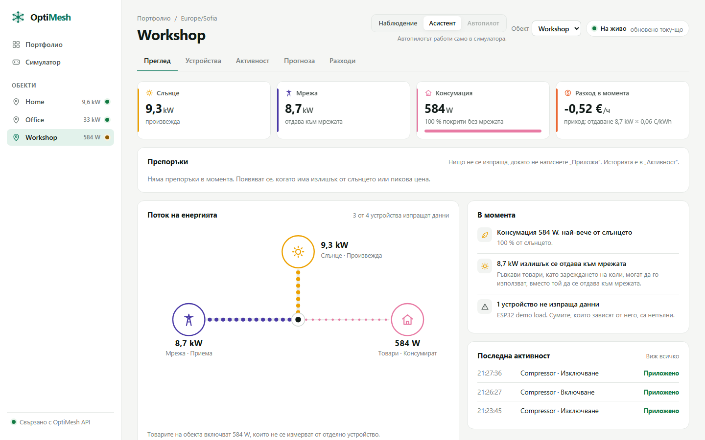
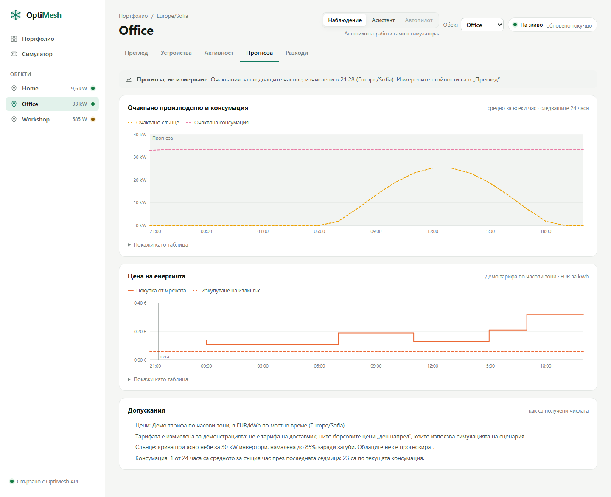

# Демо: ръководство за сцената

Как се пуска, показва и спасява демото на OptiMesh (първо демо: неделя, 10:00). Трите действия са същите като в [REPORT.md](REPORT.md), раздел 5. Тук са командите, щракванията и какво да правите, когато нещо се счупи.

**Как е проверено.** Всичко без отметка е пуснато на 03.10.2026 на Windows 11 (лаптопът на Йордан) от `develop` `e5cf9ed`: база, брокер, API, симулатор, табло и щракванията в истински браузър (Chromium чрез Playwright). Командите с отметка **[не е пускано]** не са пускани там. На тази машина няма Docker, затова PostgreSQL 17 и Mosquitto 2 са пуснати без Docker ([приложение А](#приложение-а-без-docker)). От API нагоре всичко е същото като с Docker.

## 1. Преди демото

### Машината

- Node.js 24 LTS, [uv](https://docs.astral.sh/uv/getting-started/installation/) (сам сваля Python 3.12) и Docker Desktop. Ако няма Docker, вижте [приложение А](#приложение-а-без-docker).
- Докато има интернет, свалете зависимостите. После демото не иска интернет: таблото вика само `localhost:3000` и `localhost:8000` (проверено на всички седем страници).

  ```powershell
  npm ci                                  # корен на репото
  cd services/api
  uv sync --frozen --python 3.12
  docker compose pull db mqtt             # [не е пускано]
  ```

- `npm run dev` показва долу вляво значката „N“ на Next.js. Тя не е част от продукта.

### `.env`

Файлът е `services/api/.env`. Не го показвайте на проектора и не го добавяйте в Git.

```powershell
cd services/api
Copy-Item .env.example .env             # само ако още няма .env
```

- За локалния брокер трябват и трите заедно: `MQTT_HOST=127.0.0.1`, `MQTT_PORT=1883` и `MQTT_TLS=false`. Иначе API отказва да стартира (от PR #26). `.env.example` вече ги съдържа.
- `DATABASE_URL` сочи локалния PostgreSQL на `127.0.0.1:5432`, а `CORS_ORIGINS` съдържа `http://localhost:3000`.
- Не попълвайте `MQTT_CA_FILE`, `MQTT_USERNAME` и `MQTT_PASSWORD`. Те са за брокера на Raspberry Pi ([raspberry-pi-mqtt.md](raspberry-pi-mqtt.md)).

### Свободни портове

Портове 3000 (табло) и 8000 (API) трябва да са свободни, а също 5432 (база) и 1883 (брокер):

```powershell
Get-NetTCPConnection -State Listen -LocalPort 3000,8000,5432,1883 -ErrorAction SilentlyContinue | Select-Object LocalAddress, LocalPort, OwningProcess
```

Преди пускане командата не трябва да изведе нищо. Ако изведе ред, `OwningProcess` е процесът, който държи порта. Обикновено това е забравен терминал със стар OptiMesh: затворете го.

### „Асистент“, веднъж за всеки обект

Таблото отваря всеки обект в режим „Наблюдение“, който е само за четене. Превключвателите са сиви, с подсказка „Режим „Наблюдение“ е само за четене“. След като стекът тръгне, отворете Home, Office и Workshop и натиснете „Асистент“ горе вдясно на всеки.

Изборът се пази в браузъра, отделно за всеки обект. На сцената ползвайте същия браузър и профил. В инкогнито прозорец или в друг браузър обектите пак са в „Наблюдение“. „Автопилот“ е сив нарочно, защото работи само в симулатора.

### Часовникът

`--hour 12` държи слънцето на симулатора по обед. Прогнозата и разходите обаче вървят по истинския часовник (Europe/Sofia), така че в 10:00 прогнозата започва от 10:00.

„Разход досега днес“ брои само енергията, измерена след пускането на стека, а след reset започва от нула. По-показателно е числото „Очакван разход за деня“.

## 2. Пускане

Всяка стъпка е в отделен терминал, по този ред.

```powershell
# Терминал 1, корен на репото: база и брокер (връща терминала)
docker compose up -d db mqtt                    # [не е пускано]: тук няма Docker, вижте приложение А
```

```powershell
# Терминал 2, services/api: схема, демо обекти, после API на :8000 (остава да работи)
cd services/api
uv run --frozen alembic upgrade head            # проверка: uv run --frozen alembic current -> 0003 (head)
uv run --frozen python -m app.seed              # „Seeded 3 sites and 17 devices“
uv run --frozen uvicorn app.main:app --reload   # „Application startup complete.“
```

На Windows не махайте `--reload`. Без него uvicorn ползва Proactor event loop, на който MQTT клиентът не работи. Готово е, когато http://127.0.0.1:8000/api/v1/status връща `{"mqtt":"connected"}`.

```powershell
# Терминал 3, services/api: виртуални устройства (остава да работи)
cd services/api
uv run --frozen python -m app.simulator --hour 12
```

Симулаторът пише „Simulating 16 devices on 3 sites“. До 5 s Home е 6/6, Office 7/7, а Workshop 3/4 устройства на линия. В Workshop „ESP32 demo load“ чака истинската платка.

Ако платката няма да е на сцената, пуснете симулатора с `--hour 12 --include-hardware`. Тогава пише „Simulating 17 devices“ и редът на ESP32 тръгва до около 4 s. Никога не пускайте едновременно платката и `--include-hardware`.

```powershell
# Терминал 4, корен на репото: таблото на :3000 (остава да работи)
npm run dev
```

Първото отваряне на страница се компилира около 3 s, следващите са под 1 s. Минете веднъж през всички страници, преди да влезе публиката.

**Проверка преди публиката:**

- http://127.0.0.1:8000/api/v1/status връща `{"mqtt":"connected"}`.
- http://localhost:3000 показва Home, Office и Workshop със стойности, а долу в менюто пише „Свързано с OptiMesh API“.
- И трите обекта са в „Асистент“.

## 3. Трите действия

Наредбата е важна: действие 1 изключва Compressor, а действие 2 предлага да се включи отново.

### Действие 1: Connect

**Щраквате:** http://localhost:3000 („Портфолио“) → Workshop. „Асистент“ вече е избран. Превъртете до „Гъвкави товари“ и изключете „Compressor“ от превключвателя му.

**Публиката вижда:**

- Плочките „Слънце“, „Мрежа“, „Консумация“ и „Разход в момента“, анимирания „Поток на енергията“ и чипа „На живо“.
- След щракването редът за миг показва „Чака устройството…“, после „Приложено“. Същото се появява и в „Последна активност“. Тук отне между 30 и 150 ms.
- Консумацията пада с около 1,5 kW.
- По желание натиснете „Наблюдение“: превключвателят посивява. После се върнете на „Асистент“.

**Изречение:** „Командата става „Приложено“ едва когато устройството я потвърди. Това, че брокерът я е приел, още не е потвърждение.“



### Действие 2: Predict

**Щраквате:** Office → „Прогноза“ → „Разходи“. После Workshop → „Преглед“. В „Препоръки“ се появява „Включете „Compressor“ сега“: натиснете „Приложи“.

**Публиката вижда:**

- **„Прогноза“:** очакваното слънце и консумацията за следващите 24 часа, цената по часове (стъпала) и „Допускания“, т.е. откъде идва всяко число: демо тарифа, крива при ясно небе, консумацията от последната седмица или текущата.
- **„Разходи“:** „Разход досега днес“, взетата и отдадената енергия, „Очакван разход за деня“ и таблица по часове.
- **Workshop:** препоръката се появява, защото Compressor е изключен, а около 7–9 kW слънце се отдава към мрежата („спестява около 0,34 € на час“). След „Приложи“ бутонът става „Приложено“ с бележка „Приложено: устройството потвърди.“ (тук: 150 ms).
- Препоръките се опресняват на 60 s, а при отваряне на „Преглед“ се зареждат веднага. Затова минете през Office и после се върнете в Workshop.

**Изречение:** „Прогнозата казва на какви допускания стъпва. Препоръката не прави нищо сама: изпраща се само с „Приложи“ и пак чака потвърждение от устройството.“



Същият сценарий има и вариант в терминала, който не иска база, брокер или мрежа:

```powershell
cd services/api
uv run --frozen python -m app.sim.scenario_office
```

Изходът тук беше 27.77 EUR без управление, 18.24 EUR с Autopilot и 17.48 EUR при оптимума, както в README.

### Действие 3: Optimize

**Щраквате:** „Симулатор“ в менюто (http://localhost:3000/simulator) → „Първо гледай Автопилота“ → „Към резултатите“.

По желание пуснете ръчния ден с „Започни деня“ или „Изиграй деня“. Денят тръгва сам. Имате „Пауза“, „+15 мин“, скорост от 0,5× до 4×, режим на батерията, термостат и включване на колите в зарядните.

**Публиката вижда:** заглавието „Автопилотът зареди навреме 10/10 коли; простите правила — 7/10.“ и таблицата със сравнението: пик от мрежата 35 kW при простите правила и 22 kW при Автопилота. Под нея пише, че това са резултати от симулация, които не обещават същите спестявания за реален обект.

**Изречение:** „Същият ден и същите коли: Автопилотът зарежда и десетте навреме и държи пика на 22 kW, а простите правила оставят 3 коли незаредени.“

## 4. Ако нещо се обърка

**Няма интернет.** Не пречи, всичко върви на localhost. Интернет е нужен само за `npm ci`, `uv sync`, `docker compose pull` и (без Docker) `micromamba create`. Пуснете ги предната вечер.

**Платката мълчи.** В Workshop „ESP32 demo load“ е с червена точка, точката на Workshop в менюто е жълта, а „В момента“ казва „1 устройство не изпраща данни“. Не чакайте. Спрете терминал 3 и го пуснете отново със заместител на платката:

```powershell
uv run --frozen python -m app.simulator --hour 12 --include-hardware
```

Редът на ESP32 тръгва до около 4 s. Не щраквайте превключвателя на истинската платка: фърмуерът не приема команди и след 15 s командата става „Няма отговор“. Истинската платка минава през брокера на Raspberry Pi по TLS ([raspberry-pi-mqtt.md](raspberry-pi-mqtt.md)). **[не е пускано]**

**API спре** (терминал 2 е затворен или процесът е паднал). Таблото не се срива:

- чипът горе става „Повторно свързване…“;
- излиза съобщение „Връзката с API прекъсна. Показани са последните известни стойности, докато връзката се възстанови.“;
- долу в менюто пише „Няма връзка с API“.

Пуснете API отново в терминал 2:

```powershell
uv run --frozen uvicorn app.main:app --reload
```

Страницата сама се връща на „На живо“, без презареждане (тук: 9 s след командата). Симулаторът не се рестартира, защото говори с брокера, а не с API.

**Базата или брокерът спрат.** С Docker пуснете `docker compose up -d db mqtt` и, ако API не се свърже сам до 30 s, рестартирайте терминал 2. **[не е пускано]**

**Нищо не помага.** Минете на резервния вариант (раздел 6), а числата от действие 2 покажете от терминала или от слайдовете.

## 5. Reset: начисто за 2 минути

Ползвайте го, ако историята е пълна с тестови команди или демото се е объркало.

1. Спрете терминал 3 (симулатора) и терминал 2 (API). Таблото може да остане пуснато.
2. В `services/api` изтрийте и създайте наново схемата, после сложете демо обектите:

   ```powershell
   uv run --frozen alembic downgrade base      # трие всички таблици на OptiMesh и данните в тях
   uv run --frozen alembic upgrade head
   uv run --frozen python -m app.seed          # „Seeded 3 sites and 17 devices“
   ```

3. Пуснете отново терминал 2 и терминал 3 с командите от раздел 2.

Резултатът тук: преди reset имаше 4507 измервания и 4 команди, след него 0 и 0, с 17 устройства. Щом симулаторът тръгне, всички симулирани устройства са на линия, а „Последна активност“ е празна. „Асистент“ остава избран, защото изборът е в браузъра.

С Docker има и по-груб вариант, който трие целия том на базата: **[не е пускано]**

```powershell
docker compose down -v
docker compose up -d db mqtt
```

След него пак `alembic upgrade head` и `app.seed`, както по-горе.

## 6. Резервен вариант: /simulator без бекенд

Ако базата, брокерът или API не тръгнат, действие 3 върви само с таблото:

```powershell
npm run dev
```

Отворете http://localhost:3000/simulator. Играта не вика API и работи докрай. Това е очаквано:

- в менюто под „Обекти“ пише „Недостъпно“, а долу „Няма връзка с API“;
- „Портфолио“ казва „Обектите не се заредиха (няма връзка с API).“

## 7. Спиране

Спрете терминали 4, 3 и 2. С Docker изпълнете `docker compose stop` **[не е пускано]**. Без Docker вижте приложение А.

## Приложение А: без Docker

Така е пуснато на 03.10, на Windows без администраторски права. PostgreSQL 17 и Mosquitto 2 идват от conda-forge с [micromamba](https://github.com/mamba-org/micromamba-releases/releases) (`micromamba-win-64.exe`, един файл), със същите потребител, парола, база и портове като `compose.yaml`. Пуснато е с папка в `%TEMP%`; единствената разлика е пътят в `$srv`.

**Веднъж:**

```powershell
$srv = "$env:USERPROFILE\optimesh-srv"
$env:MAMBA_ROOT_PREFIX = "$srv\mamba"
micromamba.exe create -y -p "$srv\env" -c conda-forge "postgresql=17" "mosquitto=2"
$bin = "$srv\env\Library\bin"
Set-Content "$srv\pw.txt" "optimesh" -NoNewline          # паролата от compose.yaml
& "$bin\initdb.exe" -D "$srv\pgdata" -U optimesh --pwfile="$srv\pw.txt" -A scram-sha-256 -E UTF8 --locale=C
Remove-Item "$srv\pw.txt"
& "$bin\pg_ctl.exe" start -D "$srv\pgdata" -l "$srv\postgres.log" -o "-p 5432 -h 127.0.0.1" -w
$env:PGPASSWORD = "optimesh"
& "$bin\psql.exe" -h 127.0.0.1 -U optimesh -d postgres -c "CREATE DATABASE optimesh;"
& "$bin\psql.exe" -h 127.0.0.1 -U optimesh -d optimesh -c "ALTER SYSTEM SET timezone = 'UTC';"
& "$bin\pg_ctl.exe" reload -D "$srv\pgdata"
```

Защо `timezone = 'UTC'`: образът `postgres:17` е на UTC. Ако базата е на местно време, API връща времената на командите с `+03:00` вместо в UTC.

Файлът `$srv\mosquitto.conf` е като `infra/mosquitto/mosquitto.conf`, но слуша само на 127.0.0.1. С Docker това го прави `127.0.0.1:1883` в `compose.yaml`. Иначе анонимният брокер ще е отворен за цялата мрежа.

```text
listener 1883 127.0.0.1
allow_anonymous true
persistence false
log_dest stdout
```

**Всеки път, вместо терминал 1:**

```powershell
$srv = "$env:USERPROFILE\optimesh-srv"     # нов терминал: пътищата се задават отново
$bin = "$srv\env\Library\bin"
$env:PATH = "$bin;$env:PATH"               # без това mosquitto.exe не намира DLL файловете си (0xC0000135)
& "$bin\pg_ctl.exe" start -D "$srv\pgdata" -l "$srv\postgres.log" -o "-p 5432 -h 127.0.0.1" -w
& "$srv\env\Library\sbin\mosquitto.exe" -c "$srv\mosquitto.conf"     # остава да работи
```

**Спиране:** затворете терминала с Mosquitto, а PostgreSQL спрете от друг терминал:

```powershell
$srv = "$env:USERPROFILE\optimesh-srv"
& "$srv\env\Library\bin\pg_ctl.exe" stop -D "$srv\pgdata"
```

Reset-ът от раздел 5 работи без промяна.

## Какво е проверено на 03.10.2026

| Проверка | Резултат |
| --- | --- |
| `GET /health`, `GET /ready` | 200, 200 |
| `GET /api/v1/status` | `{"mqtt":"connected"}` |
| `GET /api/v1/sites` | Home 6/6, Office 7/7, Workshop 3/4 на линия до 5 s след симулатора |
| WebSocket `/api/v1/sites/{Office}/live` | първо събитие `snapshot` след 0,01 s |
| Команда `switch` към Compressor | 202 `sent`, после `pending → sent → applied` за 30 ms |
| `/forecast`, `/costs`, `/recommendations` за трите обекта | 200 навсякъде |
| Страниците `/`, обект, „Устройства“, „Активност“, „Прогноза“, „Разходи“, `/simulator` | 200 навсякъде |
| Браузър: „Асистент“, превключвател, „Приложено“ | „Приложено“ след 90 ms |
| Браузър: „Приложи“ на препоръка | „Приложено“ след 150 ms |
| API спрян и пуснат отново | „Повторно свързване…“, после „На живо“ сам, 9 s след рестарта |
| `--include-hardware` | ESP32 на линия до 4 s |
| Reset (`downgrade base`, `upgrade head`, `seed`) | 0 измервания, 0 команди, 17 устройства |
| Само `npm run dev`, без база, брокер и API | `/simulator` 200, Автопилотът и резултатите работят; `/` 200 с „Обектите не се заредиха“ |

В тази проверка процесите са спирани с `taskkill`, а не с Ctrl+C.
