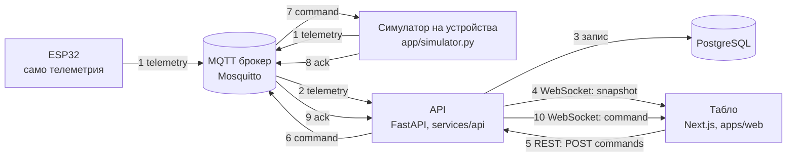

# OptiMesh — отчет за проекта

| | |
|---|---|
| Commit | `a827d10270a3b42483927dfa82406ba5b06114cd` на `develop` (след PR #48 и commit `a827d10`). Раздел 13 и редовете за issue в раздели 9 и 14 са проверени на него. Останалото е проверено на `3093ee1` (след PR #44 и #45); оттогава са сменени само README.md, CLAUDE.md и този отчет. |
| Време | 2026-10-04, 00:26 UTC (04.10, 03:26 българско време) |
| За кого | Митко и Даниел: слайдове и документация. Не е нужно да сте чели кода. |
| Как е направен | Изготвен от агент за код по задание на Стоян (GamingSimpwa). Проверете число, преди да го сложите на слайд. |
| Източници | [README.md](../README.md), [docs/DEMO.md](DEMO.md), [docs/contracts.md](contracts.md), [docs/sites-api.md](sites-api.md), [docs/frontend-handoff.md](frontend-handoff.md), [game/README.md](../game/README.md), [game/VALIDATION.md](../game/VALIDATION.md), [.github/project-plan.json](../.github/project-plan.json), кодът, `git log` и сливаните PR |

**Как да четете числата.** Всяко количество има етикет:

- **измерено**: командата е пусната сега, на този commit. Командата е дадена.
- **по отчет**: число на някой друг, което не е възпроизведено тук. Пише чие е.
- **допускане**: входна стойност, която никой не е измерил (константа в кода или в сценарий).

Номерата на issue и PR, портовете, UUID, версиите, датите и часовете са идентификатори. Те нямат етикет. Ако нещо липсва в репото, пише „не е намерено в репото“. Ако два източника си противоречат, печели кодът и това е казано.

---

## 0. Ако имаш две минути

1. OptiMesh е енергиен автопилот за един обект. Той мери, прогнозира слънце и цена и решава кога работи всяко устройство.
2. Работи цикълът в двете посоки: устройство → MQTT → API → PostgreSQL → WebSocket → табло и команда от таблото → устройство → потвърждение (ack). Проверено в CI. Целият стек е пускан и на живо, без Docker, с щраквания в браузър (по отчет: Йордан, 03.10, [docs/DEMO.md](DEMO.md)).
3. ESP32 праща телеметрия по TLS до брокер на Raspberry Pi (по отчет: PR #22 на DGtao13). Команди ESP32 още не приема.
4. Има три отделни симулации: `app/sim` в терминала (борсови цени, LP Autopilot), игра в браузъра `/simulator` (без бекенд) и OptiMesh Game на Даниел в `game/` (Godot, без бекенд). Числата им не се сравняват (раздел 7).
5. Таблото е на български. Показва прогнозата и разходите в разделите „Прогноза“ и „Разходи“, а препоръките в режим „Асистент“, където команда се изпраща само с „Приложи“.
6. По желание има вход с имейл и парола през Supabase (PR #44). След вход в „Моите обекти“ създавате свой обект, в „Добави устройство“ му добавяте устройство, а „Свързване“ показва ID, MQTT темите и примерна телеметрия за него. Без двете стойности `NEXT_PUBLIC_SUPABASE_…` тези екрани са скрити. „Портфолио“ и `/api/v1` още показват всички обекти на всички (#3).
7. Главното число: един симулиран офисен ден струва 27,77 EUR без управление и 18,24 EUR с Autopilot, и в двата случая с 10 от 10 заредени коли (измерено: `uv run --frozen python -m app.sim.scenario_office`). Решението е в раздел 7.
8. Три неща, които не твърдим:
   - универсални спестявания: това е един симулиран ден;
   - по-малко износване на батерията: Autopilot я цикли 0,80 срещу 0,21 пъти (измерено, същата команда);
   - безопасно публично внедряване: `/api/v1` няма автентикация, затова само в LAN.

---

## 1. Какво е OptiMesh и тезата за журито

**Тема:** „Енергията около нас“. **Слоган:** "Connect. Predict. Optimize."

**Какво е.** OptiMesh е софтуер за един обект: дом, работилница или офис. Той събира измервания от устройствата. Прогнозира слънцето и цената. Предлага или изпълнява кога да работи всяко устройство. Устройство е всичко, което говори договора v1: ESP32, симулатор или бъдещ адаптер.

**Проблемът.** Борсовата цена на тока се сменя на всеки 15 минути (по отчет: коментарът в `scenario_office.py` за 15-минутна резолюция). В сценария на `app/sim` за 30.09.2026 цената между 07:00 и 19:00 е от 9,66 до 231,48 EUR/MWh. Това е по отчет: цените са от api.energy-charts.info според коментара в [scenario_office.py](../services/api/app/sim/scenario_office.py), а тук не са сверени с източника. Един офис с 10 коли и 3 зарядни (допускане) може да зарежда по много начини. Кога зарежда решава сметката, пика и дали колите са готови навреме.

**Тезата за журито.**

1. Един договор за всички устройства. За платформата реален ESP32 и симулатор изглеждат еднакво (раздели 3 и 4).
2. При променлива цена планирането по прогноза намалява разхода, без да изпуска колите. В симулирания офисен ден: 27,77 → 18,24 EUR при 10/10 заредени коли (измерено, раздел 6).
3. Показваме и границите. При плоска тарифа печалба няма. Батерията се цикли повече. Публично внедряване още не е безопасно (раздел 8).

**Рамка на състезанието.** Всичко в тази таблица е по отчет: информационен пакет за участниците.

| Какво | Кога и колко |
|---|---|
| Първо демо | неделя 04.10, 10:00 |
| Предаване (слайдове + GitHub репо) | неделя 04.10, 12:30 |
| Полуфинал | 13:00; 7 мин представяне + 3 мин въпроси |
| Финал | 15:00; 10 мин представяне + 5 мин въпроси |
| Оценка | идея и проблем 25 %, иновация 25 %, техническо изпълнение 30 %, презентация 20 % |
| Бележка на журито | Чистото репо има значение: добри PR, клонове, етикети, README и принос от всеки член на екипа. |

---

## 2. Какво работи днес

„CI“ означава GitHub Actions, run 37162167204 на този commit: зелено (по отчет: GitHub Actions). „Пуснато сега“ означава, че командата е пусната на този commit. „На живо“ означава пускането на целия стек от [docs/DEMO.md](DEMO.md): 03.10, Windows 11, `develop` `e5cf9ed`, PostgreSQL 17 и Mosquitto 2 без Docker, щраквания в Chromium (по отчет: Йордан). То не е повторено тук: на тази машина няма Docker, база и брокер.

| Функция | Къде в кода | Как е проверено | Какво липсва |
|---|---|---|---|
| Договор v1: телеметрия, команда, ack | `services/api/app/schemas.py`, `contracts/`, [docs/contracts.md](contracts.md) | CI; пуснато сега: `pytest` (`tests/test_contract.py`) | Съгласувани ACL на брокера; версия на WebSocket съобщенията (#2) |
| Приемане на телеметрия по MQTT и HTTP | `services/api/app/mqtt.py`, `app/platform.py`, `POST /api/v1/telemetry` | CI (тестове с PostgreSQL); пуснато сега: `pytest` без база; на живо с локален брокер: по отчет (Йордан, DEMO.md) | ACL по устройство се пазят на брокера, не в репото |
| MQTT по TLS | `app/config.py`, `app/mqtt.py`, `app/simulator.py` | CI (`tests/test_mqtt_tls.py`); с реалния Raspberry Pi: по отчет ([raspberry-pi-mqtt.md](raspberry-pi-mqtt.md); PR #26 на DGtao13) | Пускането на живо от DEMO.md е с локален брокер без TLS, не с Raspberry Pi |
| Живо табло по WebSocket | `app/api.py` (`/live`), `app/live.py`, `apps/web/src/hooks/use-site-live.tsx` | CI; на живо: по отчет (Йордан, DEMO.md: първо събитие `snapshot` след 0,01 s; след рестарт на API таблото се връща на „На живо“ без презареждане, 9 s след рестарта) | Няма автентикация; съобщенията нямат версия |
| Команди с потвърждение | `app/platform.py`, `app/api.py`, `apps/web/src/components/device-list.tsx` | CI; на живо: по отчет (Йордан, DEMO.md: превключвател → „Приложено“ след 90 ms) | Автентикация, `requested_by`, блокировки, ръчно предимство (#8) |
| Симулатор на устройства по MQTT | `services/api/app/simulator.py` | Не е пускан сега (няма брокер на тази машина); на живо: по отчет (Йордан, DEMO.md: 16 устройства, с `--include-hardware` 17) | — |
| ESP32 фърмуер | [firmware/esp32-telemetry/](../firmware/esp32-telemetry/README.md) | По отчет (PR #22 на DGtao13: телеметрия на около всеки 5 s през TLS до Mosquitto на Raspberry Pi). CI не го компилира. | Не приема команди, не праща ack, не управлява изход (GPIO). Мощността е постоянна симулирана стойност. |
| Табло на български (PR #38): „Портфолио“; за всеки обект „Преглед“, „Устройства“, „Активност“; графика на мощността | `apps/web/src/app`, `apps/web/src/components` | CI; пуснато сега: lint, typecheck, `npm test`, build; на живо: по отчет (Йордан, DEMO.md: всички седем страници → 200) | На английски остават имената на обектите и устройствата от `app/seed.py` и съобщенията за грешка от API; проверка с клавиатура и на мобилен екран не е записана (#7) |
| Прогноза, разходи, препоръки: API и раздели „Прогноза“ и „Разходи“ (PR #34) | `app/insights.py`, `forecast.py`, `costs.py`, `recommendations.py`, `tariff.py`; `apps/web/src/components/site-forecast.tsx`, `site-costs.tsx` | CI (`tests/test_insights_db.py` с база); пуснато сега: `tests/test_insights.py`, `npm test` (`site-forecast.test.tsx`, `site-costs.test.tsx`); на живо: по отчет (Йордан, DEMO.md: трите маршрута → 200 за трите обекта) | Тарифата е измислена демо тарифа |
| Режими „Наблюдение“ и „Асистент“ с препоръки (PR #35) | `apps/web/src/components/mode-switch.tsx`, `recommendations.tsx`, `apps/web/src/lib/assist.ts` | CI; пуснато сега: `npm test` (`mode-switch.test.tsx`, `recommendations.test.tsx`); на живо: по отчет (Йордан, DEMO.md: „Приложи“ → „Приложено“ след 150 ms) | Изборът се пази само в браузъра: „Наблюдение“ спира командите само в таблото, а API приема команди от всеки клиент до #3. „Автопилот“ е изключен за реални обекти. |
| Сценарий за цял ден и LP Autopilot | `services/api/app/sim/` | Пуснато сега: `python -m app.sim.scenario_office` и `tests/test_sim.py` | Няма API и няма екран; климатикът е част от постоянния товар |
| Игра `/simulator` | `apps/web/src/sim/`, `apps/web/src/components/simulator/` | Пуснато сега: `npm test`; `next start` и `GET /simulator` → 200 без бекенд, със заглавие „Симулатор · OptiMesh“. Минавана в браузър без бекенд: по отчет (Йордан, DEMO.md). | Autopilot тук е набор от правила, не LP |
| OptiMesh Game (`game/`, PR #45): изложбената игра на Даниел на Godot 4.5, внесена с историята си от DGtao13/OptiMesh-Game | `game/` (`scripts/`, `scenes/`, `tests/`), [game/README.md](../game/README.md) | По отчет: [game/VALIDATION.md](../game/VALIDATION.md), DGtao13 (седем пакета тестове, 2263 проверки без грешка). CI не я пуска, а тук не е пускана: на тази машина няма Godot. | Само за Windows x86_64 (pre-release v0.1.1-demo). Посетител без помощ и дълга работа на лаптопа за изложбата не са проверени (game/VALIDATION.md). Стратегията „OptiMesh demo“ е евристика, не LP Autopilot. |
| `/sites`: създаване на обект и устройство, списък на собствените обекти и устройствата им (PR #42), история, Supabase JWT | `app/auth.py`, `app/registry.py`, `app/history.py`, [docs/sites-api.md](sites-api.md) | CI (`test_auth.py`, `test_registry.py`, `test_history.py`); тестовете за списъците от PR #42 са в `test_registry.py` и вървят само с база, затова не са пускани сега | `/api/v1` е без проверка (#3). Екраните в таблото са на следващия ред. |
| Вход, „Моите обекти“, „Добави устройство“ и „Свързване“ (PR #44, по желание) | `apps/web/src/app/sign-in/`, `app/my-sites/`; `components/sign-in.tsx`, `account.tsx`, `my-sites.tsx`, `owned-site.tsx`, `device-connect.tsx`; `hooks/use-auth.tsx`; `lib/auth.ts`, `registry.ts`, `connect.ts` | CI; пуснато сега: `npm test` (`onboarding.test.tsx`, `auth.test.ts`, `connect.test.ts`, `registry.test.ts`: 49 passed в 4 файла), build; `next start` без двете стойности: `/sign-in` и `/my-sites` → 404, `/` → 200 без „Вход“ в менюто. С истински проект в Supabase (регистрация, вход, „Нов обект“, устройство, телеметрия → „на линия“): по отчет: docs/DEMO.md, Йордан, 04.10 | „Портфолио“, менюто и `/api/v1` още показват всички обекти на всички (#3). Без `NEXT_PUBLIC_SUPABASE_URL` и `NEXT_PUBLIC_SUPABASE_PUBLISHABLE_KEY` в `apps/web/.env.local` екраните са скрити (`notFound()` в страниците). Входът иска интернет. |
| Миграции `0001 → 0002 → 0003` | `services/api/alembic/versions/` | CI: `upgrade`, `check`, `downgrade`, `upgrade`; на живо: `upgrade head`, `seed` и reset, по отчет (Йордан, DEMO.md) | — |
| Демо на живо от край до край | [docs/DEMO.md](DEMO.md) | По отчет (Йордан, 03.10): стекът без Docker, трите действия, отпадане на API, `--include-hardware`, reset, резерв без бекенд | `docker compose` не е пускан никъде; пътят на реалния ESP32 през Raspberry Pi не е минат в тази проверка |
| CI на всеки PR | `.github/workflows/ci.yml` | Последният run на `develop` е зелен (по отчет: GitHub Actions, run 37162167204) | Няма внедряване (#15); тестовете на `game/` не са в CI |

**Проверките на този commit** (всички числа в блока са измерени, около 23:52 UTC):

```text
# корен на репото
npm run lint && npm run typecheck && npm test && npm run build
→ lint и typecheck без грешки; Test Files 23 passed (23); Tests 199 passed (199); build: Compiled successfully

# services/api
uv sync --frozen --python 3.12
uv run --frozen ruff check .           → All checks passed!
uv run --frozen ruff format --check .  → 47 files already formatted
uv run --frozen mypy app               → Success: no issues found in 29 source files
uv run --frozen pytest -q              → 243 passed, 54 skipped, 1 warning
```

Пропуснатите 54 теста (измерено) са тестовете с база. Те вървят само при зададен `TEST_DATABASE_URL`. В CI вървят с PostgreSQL 17: там backend дава 322 passed, а frontend 199 passed (по отчет: GitHub Actions, run 37162167204).

---

## 3. Архитектура



Стъпки 1–4 са пътят от устройството до таблото. Стъпки 5–10 са пътят на командата обратно. ESP32 участва само в стъпка 1, защото фърмуерът не приема команди. Обратния път днес го минава симулаторът.

**Компоненти**

- `firmware/esp32-telemetry`: фърмуер за ESP32 (ESP-IDF). Праща телеметрия по MQTT с TLS.
- `services/api/app/simulator.py`: виртуални устройства. Пращат телеметрия и отговарят на команди с ack по същия договор.
- MQTT брокер: Mosquitto. Локално е в `compose.yaml`, без парола и само на 127.0.0.1. За хардуера е на Raspberry Pi с TLS (по отчет: README).
- `services/api/app/mqtt.py`: мост между MQTT и API. Приема телеметрия и ack и изпраща команди.
- `services/api/app/platform.py`: ядрото. Проверява, записва, пази последното състояние и води командите.
- `services/api/app/api.py`: REST под `/api/v1` и WebSocket `/api/v1/sites/{site_id}/live`.
- `services/api/app/insights.py`: прогноза, разходи и препоръки за сайт.
- `services/api/app/registry.py` и `auth.py`: маршрутите `/sites` с проверка на Supabase JWT: създаване, списък на собствените обекти и устройства, история.
- PostgreSQL: сайтове, устройства, измервания и команди. Схемата се води с Alembic.
- `apps/web`: таблото, на български. „Портфолио“; за всеки обект „Преглед“, „Устройства“, „Активност“, „Прогноза“ и „Разходи“; режими „Наблюдение“ и „Асистент“; играта `/simulator`; по желание вход, „Моите обекти“ и свързване на устройства (PR #44), които викат `/sites`.
- `services/api/app/sim`: симулация на цял ден в паметта и LP Autopilot. Няма API и екран.
- `apps/web/src/sim`: отделна симулация на TypeScript за играта. Работи само в браузъра.
- `game/`: OptiMesh Game, отделна игра на Godot 4.5 със своя симулация. Не говори с API и не е в CI.

**Технологии**

- Frontend: Next.js 16, React 19, TypeScript, Tailwind CSS 4, vitest.
- Backend: Python 3.12, FastAPI, SQLAlchemy, Alembic, psycopg, pydantic, aiomqtt, PyJWT, uv.
- Оптимизация: numpy и scipy (`linprog` с решател HiGHS).
- База: PostgreSQL 17 локално и в CI; Supabase при хостване ([docs/database.md](database.md)).
- Брокер: Mosquitto 2.
- Фърмуер: ESP-IDF 5.3.1 през PlatformIO (`espressif32@6.9.0`).
- CI: GitHub Actions с две задачи, `frontend` и `backend`. CodeRabbit прави преглед на PR.

---

## 4. Договорът накратко

Източник: [docs/contracts.md](contracts.md). Там, където кодът казва друго, е отбелязано.

**Теми (topics)**

```text
optimesh/v1/sites/{site_id}/devices/{device_id}/telemetry   устройство → платформа
optimesh/v1/sites/{site_id}/devices/{device_id}/command     платформа → устройство
optimesh/v1/sites/{site_id}/devices/{device_id}/ack         устройство → платформа
```

Флагът retain не се ползва. Всяко устройство слуша само своята тема `command`.

Числата в JSON примерите по-долу са примерни стойности от docs/contracts.md (допускане), не измервания.

**Телеметрия** (устройство → платформа):

```json
{
  "version": 1,
  "site_id": "5e000000-0000-4000-8000-000000000002",
  "device_id": "de000000-0000-4000-8000-000000002003",
  "message_id": "6f1c2a8e-3b7d-4c51-9a0e-2d4b8f7e1c33",
  "observed_at": "2026-10-02T18:00:00Z",
  "metrics": { "power_w": 58.4, "energy_wh": 125.7, "voltage_v": 229.6, "current_a": 0.254 },
  "state": { "on": true }
}
```

- `message_id` е нов UUID за всяко съобщение. Повторно изпратено съобщение се игнорира, затова повторите са безопасни.
- Нужно е поне едно от `power_w`, `energy_wh` и `soc_pct`.
- Непознато поле прави съобщението невалидно.

**Команда** (платформа → устройство):

```json
{
  "version": 1,
  "command_id": "44444444-4444-4444-8444-444444444444",
  "issued_at": "2026-10-02T18:00:00Z",
  "expires_at": "2026-10-02T18:00:15Z",
  "type": "switch",
  "params": { "on": false }
}
```

Типовете са `switch` (`{"on": true|false}`) и `power_setpoint` (`{"power_w": ≥ 0}`, като 0 означава спри). Бекендът проверява способността (capability) и границите на устройството, преди да прати командата.

**Потвърждение (ack)** (устройство → платформа):

```json
{ "version": 1, "command_id": "44444444-4444-4444-8444-444444444444", "status": "applied", "reason": null, "observed_at": "2026-10-02T18:00:00.350Z" }
```

`status` е `applied` или `rejected`. Пътят на командата е `pending` → `sent` → `applied` / `rejected`. Без ack командата става `expired`, а `failed` значи, че брокерът е недостъпен. `sent` значи само, че брокерът е приел командата. Това не е потвърждение от устройството.

**Единици.** Мощност във W, енергия в Wh, заряд на батерията `soc_pct` от 0 до 100, време в UTC.

**Знаци на `power_w`**

| Вид устройство | Положително означава |
|---|---|
| `grid_meter` | внос от мрежата (износът е отрицателен) |
| `solar_inverter` | производство |
| `battery` | зареждане (разреждането е отрицателно) |
| всички останали (`load`, `smart_plug`, `boiler`, `hvac`, `ev_charger`) | консумация |

**Времеви прозорци.** Всички стойности са зададени в кода или в договора, никой не ги е мерил.

| Правило | Стойност | Къде | Етикет |
|---|---|---|---|
| `observed_at` не по-старо от | 24 h | `app/platform.py`, `MAX_PAST_AGE` | допускане |
| `observed_at` не по-напред в бъдещето от | 5 min | `app/platform.py`, `MAX_CLOCK_SKEW` | допускане |
| Устройството е offline след | 15 s без данни | `app/config.py`, `device_stale_after_s` | допускане |
| Командата изтича след | 15 s | `app/config.py`, `command_ttl_s` | допускане |
| WebSocket праща snapshot поне на всеки | 5 s | `app/api.py`, `SNAPSHOT_REFRESH_S` | допускане |
| Препоръчана честота на телеметрия | 2–5 s | docs/contracts.md, §4 | допускане |
| ESP32 публикува на всеки | 5000 ms | `firmware/esp32-telemetry/include/config.example.h` | допускане |
| Дължина на `reason` в ack | до 200 знака | `app/schemas.py` | допускане |

Двете граници за `observed_at` са включени. Извън тях телеметрията се отхвърля.

**Къде docs/contracts.md и кодът се разминават (печели кодът)**

| docs/contracts.md казва | Кодът казва |
|---|---|
| Брокер `<laptop-ip>:1883`, обикновен MQTT, без парола (§1) | По подразбиране `MQTT_PORT=8883` и `MQTT_TLS=true` (`app/config.py`). Обикновен MQTT е разрешен само за брокер без парола на `localhost`, `127.0.0.1`, `::1` или `mqtt`. Брокер без TLS на IP адреса на лаптоп в LAN се отказва. |
| ESP32 с PubSubClient и QoS 0 (§7) | Фърмуерът е на ESP-IDF с вградения ESP-MQTT клиент, QoS 1 и TLS ([firmware README](../firmware/esp32-telemetry/README.md)). |
| ESP32 се флашва с UUID от `app/seed.py`: Workshop / „ESP32 demo load“ (§2) | [docs/raspberry-pi-mqtt.md](raspberry-pi-mqtt.md) (преди беше в README) дава проверената тема на Raspberry Pi с други UUID (`0e708814-…`, `42c485b1-…`), които не са в `app/seed.py`. За да се види ESP32 в таблото, неговите UUID трябва да са регистрирани в базата, която ползва API. |
| Таблицата „Frontend API“ не съдържа прогноза, разходи и препоръки | `app/api.py` има `GET /api/v1/sites/{site_id}/forecast`, `/costs` и `/recommendations` (PR #30). |

---

## 5. Демото в три действия

Командите, редът на пускане, reset-ът и пускането без Docker са само в [docs/DEMO.md](DEMO.md). Тук е какво вижда публиката, какво казвате и какво правите, когато нещо падне. Текстовете в кавички са етикетите от таблото (`apps/web/src`); имената на обектите и устройствата (Workshop, „Compressor“) идват от `app/seed.py` и са на английски.

**Как е проверено.** Трите действия, отпадането на API, `--include-hardware`, reset-ът и резервът без бекенд са минати на 03.10 на Windows 11, от `develop` `e5cf9ed`, с PostgreSQL 17 и Mosquitto 2 без Docker и щраквания в Chromium (по отчет: Йордан, DEMO.md). Там не са пускани `docker compose` и реалният ESP32 през Raspberry Pi: те остават **[не е пускано]**. Стъпката „Свой обект и устройство“ с истински проект в Supabase е мината на 04.10 (по отчет: docs/DEMO.md, Йордан, 04.10). На машината на отчета сега са пуснати само сценарият в терминала, `/simulator` и скритите екрани за вход без бекенд и API без база.

**Преди публиката** (DEMO.md, раздели 1 и 2): http://127.0.0.1:8000/api/v1/status връща `{"mqtt":"connected"}`, долу в менюто пише „Свързано с OptiMesh API“, а Home, Office и Workshop са превключени на „Асистент“. По подразбиране всеки обект се отваря в „Наблюдение“, което е само за четене. Изборът се пази в браузъра, отделно за всеки обект, затова на сцената ползвайте същия браузър и профил.

### Действие 1: Connect (устройства → табло → команда → ack)

**Какво вижда публиката.**

- „Портфолио“ с трите обекта и живи стойности.
- В Workshop: плочките „Слънце“, „Мрежа“, „Консумация“ и „Разход в момента“, анимирания „Поток на енергията“ и чипа „На живо“.
- Изключвате „Compressor“ в „Гъвкави товари“. Редът за миг показва „Чака устройството…“, после „Приложено“. Същото се появява в „Последна активност“. Отне между 30 и 150 ms, а консумацията пада с около 1,5 kW (по отчет: Йордан, DEMO.md).
- По желание натиснете „Наблюдение“: превключвателят посивява. После се върнете на „Асистент“.

**Изречение:** „Командата става „Приложено“ едва когато устройството я потвърди. Това, че брокерът я е приел, още не е потвърждение.“

**Ако нещо падне**

- **Платката мълчи:** в Workshop „ESP32 demo load“ е с червена точка, а „В момента“ казва „1 устройство не изпраща данни“. Не чакайте: пуснете симулатора на устройства отново с `--include-hardware` (DEMO.md, раздел 4). Редът на ESP32 тръгва до около 4 s (по отчет: Йордан). Никога не пускайте едновременно платката и `--include-hardware`.
- **Истинската платка е на сцената:** не щраквайте нейния превключвател. Фърмуерът не приема команди и след 15 s командата става „Няма отговор“. Показвайте ключа на устройство от симулатора.
- **API спре:** таблото не се срива. Чипът става „Повторно свързване…“, излиза „Връзката с API прекъсна. Показани са последните известни стойности, докато връзката се възстанови.“, а долу в менюто пише „Няма връзка с API“. Пуснете API отново (DEMO.md, раздел 4): страницата сама се връща на „На живо“ (по отчет: Йордан, 9 s след рестарта).
- **Интернетът:** не пречи на трите действия, те вървят на `localhost`. Интернет трябва за свалянето на зависимостите предната вечер (DEMO.md, раздел 1) и за входа в стъпката по желание по-долу.
- **Базата или брокерът:** с Docker ги пуснете отново по DEMO.md, раздел 4. **[не е пускано]** Без база API връща 503 за `/api/v1/sites` и `/ready`, а `/health` е 200. **[пуснато сега]** в 23:54 UTC на този commit, без база и без брокер: `/health` → `{"status":"ok",…}`, `/ready` и `/api/v1/sites` → `{"detail":"Database unavailable"}`, `/api/v1/status` → `{"mqtt":"disabled"}`. Ако не тръгне, минете на действие 3.

**По желание, след действие 1: свой обект и устройство.** „Вход“ → „Моите обекти“ → „Нов обект“, после „Добави устройство“ и „Свързване“ с ID, MQTT темите и примерната телеметрия на новото устройство. Иска интернет, защото входът минава през Supabase, и двете стойности `NEXT_PUBLIC_SUPABASE_…` в `apps/web/.env.local`. Щракванията са в [docs/DEMO.md, „Свой обект и устройство“](DEMO.md#по-желание-свой-обект-и-устройство). Без интернет я пропуснете: трите действия не зависят от входа.

### Действие 2: Predict (прогноза и цена)

**Какво вижда публиката** (по отчет: Йордан, DEMO.md, раздел 3).

- Office → „Прогноза“: очакваното слънце и консумацията за следващите 24 часа (допускане: константа в `app/forecast.py`), цената по часове и „Допускания“, т.е. откъде идва всяко число: демо тарифа, крива при ясно небе, консумацията от последната седмица или текущата.
- Office → „Разходи“: „Разход досега днес“, взетата и отдадената енергия, „Очакван разход за деня“ и таблица по часове. „Разход досега днес“ брои само енергията след пускането на стека, затова по-показателно е „Очакван разход за деня“.
- Workshop → „Преглед“: в „Препоръки“ се появява „Включете „Compressor“ сега“, защото в действие 1 сте го изключили, а слънцето се отдава към мрежата. Натискате „Приложи“. Бутонът става „Приложено“ с бележка „Приложено: устройството потвърди.“ (150 ms, по отчет: Йордан). Затова редът на действията е важен.

**Изречение:** „Прогнозата казва на какви допускания стъпва. Препоръката не прави нищо сама: изпраща се само с „Приложи“ и пак чака потвърждение от устройството.“

**Сценарият в терминала** не иска база, брокер или мрежа (командата е в раздел 6.1 и в DEMO.md). Публиката вижда три реда: без управление, Autopilot и „оптимум (знае бъдещето)“. Редът „оптимум“ е същият планировчик, но с перфектна прогноза. Разликата 18,24 − 17,48 = 0,76 EUR (измерено, сметнато от изхода) е колкото струва несигурността в прогнозата в този сценарий. Изречение към него: „Autopilot вижда прогнозата и текущото измерване, не бъдещето. Облакът в 12:30 го изненадва и той препланира на всяка стъпка от 15 минути.“ (Стъпката е допускане на сценария.)

**Ако нещо падне**

- **Препоръката не се появява:** препоръките се опресняват на 60 s (допускане: `RECOMMENDATIONS_POLL_MS` в `apps/web/src/lib/assist.ts`), а при отваряне на „Преглед“ се зареждат веднага. Минете през Office и се върнете в Workshop (DEMO.md).
- **API, базата или брокерът не работят:** покажете сценария в терминала. Ако лаптопът откаже, покажете на слайд изхода от раздел 6.

### Действие 3: Optimize (играта)

**Какво вижда публиката** (текстовете са от кода; щракванията: по отчет, Йордан, DEMO.md).

1. „Симулатор“ в менюто → „Можете ли да победите Автопилота?“, таблица „Колите днес“ и бутони „Започни деня“ и „Първо гледай Автопилота“.
2. „Първо гледай Автопилота“ → „Към резултатите“. По желание ръчен ден с „Започни деня“: „Пауза“, „+15 мин“, скорост, режим на батерията, термостат и включване на колите в 3 зарядни (допускане).
3. Заглавие „Автопилотът зареди навреме 10/10 коли; простите правила — 7/10.“ и таблица с колони „Вие“ (само след ръчен ден), „Прости правила“ и „Автопилот“: „Разход за деня“, „Пик от мрежата“, „Коли, заредени навреме“ и още. Под „Как сравнението остава честно“ пише: „Това са резултати от симулация. Те не обещават същите спестявания за реален обект или хардуер.“

**Изречение:** „Същият ден и същите коли: Автопилотът зарежда и десетте навреме и държи пика до 22 kW, а простите правила оставят 3 коли незаредени.“ Тези числа са измерени чрез тестовете, при seed 7 (раздел 6.2).

**Ако нещо падне.** `/simulator` не вика API и не иска база, брокер, интернет или хардуер. **[пуснато сега]** в 23:54 UTC: `next start` на сборката, без бекенд: `GET /simulator` → 200 със заглавие „Симулатор · OptiMesh“. В браузър без бекенд играта работи докрай (по отчет: Йордан, DEMO.md, раздел 6). Тогава в менюто под „Обекти“ пише „Недостъпно“, долу „Няма връзка с API“, а „Портфолио“ казва, че обектите не се заредиха. Това е очаквано. Без настроен вход приложението не тегли шрифтове и скриптове отвън.

**Втори резерв: OptiMesh Game (`game/`).** И тя не иска бекенд, мрежа или профил. Свалете Windows ZIP-а от изданието v0.1.1-demo ([game/README.md](../game/README.md)), разархивирайте го предната вечер и пуснете `OptiMesh.exe`. Това е друг сценарий: не показвайте числата ѝ до тези от `/simulator` или `app/sim` (раздел 7). Тук не е пускана (няма Godot); по отчет: game/VALIDATION.md, DGtao13.

---

## 6. Числата

### 6.1 Сценарият `app/sim`: един офисен ден

Изход от командата (измерено). Блокът е от пускането на 2026-10-03 около 19:40 UTC, на клона на PR #40 („test(sim): reproduce the comparison numbers used in the presentation“). Този PR добави последните четири реда (раздел 6.3). Командата е пусната отново на commit-а в заглавието в 23:52 UTC: и седемте реда съвпадат с блока до последната цифра, различават се само милисекундите.

```text
$ cd services/api && uv run --frozen python -m app.sim.scenario_office
Офис с 10 електромобила: 48 steps of 15 min
no management                 27.77 EUR | import  170.9 kWh | peak 30.0 kW | cars ready 10/10 | battery cycles 0.21 | 1 ms
Autopilot                     18.24 EUR | import  178.7 kWh | peak 30.0 kW | cars ready 10/10 | battery cycles 0.80 | 232 ms
optimum (knows the future)    17.48 EUR | import  184.5 kWh | peak 30.0 kW | cars ready 10/10 | battery cycles 0.96 | 225 ms
one simple rule (a person)    25.51 EUR | import  156.2 kWh | peak 30.0 kW | cars ready 8/10 | battery cycles 0.30 | 1 ms
Autopilot, no battery         21.83 EUR | import  171.4 kWh | peak 30.0 kW | cars ready 10/10 | battery cycles 0.00 | 203 ms
flat tariff, no management    34.35 EUR | import  170.9 kWh | peak 30.0 kW | cars ready 10/10 | battery cycles 0.21 | 1 ms
flat tariff, Autopilot        34.23 EUR | import  171.9 kWh | peak 24.7 kW | cars ready 10/10 | battery cycles 0.01 | 216 ms
```

Милисекундите в края на редовете са времето за изчисление на тази машина. Те не са твърдение за продукта.

| Стойност | Какво значи | Команда | Етикет |
|---|---|---|---|
| 27,77 EUR | Цена на деня без управление: първа дошла, първа зарежда, на пълна мощност | `uv run --frozen python -m app.sim.scenario_office` (в `services/api`) | измерено |
| 18,24 EUR | Цена на деня с Autopilot | същата | измерено |
| 17,48 EUR | Цена, ако планировчикът знае бъдещето; само за сравнение | същата | измерено |
| 9,53 EUR и 34,3 % | Спестено от Autopilot спрямо без управление: (27,77 − 18,24) / 27,77 | сметнато от изхода | измерено |
| 92,6 % | Каква част от възможното спестяване взима Autopilot: (27,77 − 18,24) / (27,77 − 17,48) | сметнато от изхода | измерено |
| 10/10 | Заредени навреме коли и в трите реда | същата | измерено |
| 30,0 kW | Пик на вноса и в трите реда, равен на лимита на връзката. **Пикът не пада.** | същата | измерено |
| 170,9 / 178,7 / 184,5 kWh | Внос от мрежата. **Autopilot внася повече**, но в по-евтини часове. | същата | измерено |
| 0,21 / 0,80 / 0,96 | Цикли на батерията. **Autopilot я цикли около 4 пъти повече.** | същата | измерено |
| 12,6 / 48,0 kWh | Енергия през батерията без управление / с Autopilot: цикли × 2 × 30 kWh | сметнато от изхода | измерено |
| 27,77 ±0,01; 18,24 ±0,05; 17,48 ±0,05 EUR | Тестът `test_office_day_reference_numbers` пази тези стойности. `test_every_printed_comparison_is_pinned` пази до цент всичките седем реда и броя заредени коли (раздел 6.3). | `uv run --frozen pytest -q tests/test_sim.py` → 15 passed | измерено |

### 6.2 Играта в браузъра (`apps/web/src/sim`)

Резултатите са от тестовете. Тестовете проверяват граници и отношения, а не точни суми. Команда: `npm test` от корена → 199 passed (измерено). Само тестовете на играта: `npx vitest run --root apps/web src/sim` → 46 passed в 5 файла (измерено).

| Стойност | Какво значи | Тест | Етикет |
|---|---|---|---|
| 10/10 | Autopilot зарежда всички коли навреме, при seed 7, 1 и 42 | `policies.test.ts` | измерено |
| ≤ 22 kW | Пик на вноса с Autopilot (`PEAK_CAP_W`), при seed 7, 1 и 42 | `policies.test.ts` | измерено |
| > 28,6 kW | Пик на вноса с простите правила: над 1,3 × 22 kW, при seed 7, 1 и 42 | `policies.test.ts` | измерено |
| по-малко от простите правила | Разход на Autopilot, коригиран за крайния заряд на батерията; без сума | `policies.test.ts` | измерено |
| 7/10 | Простите правила зареждат навреме 7 коли, при seed 7 | `view.test.ts` | измерено |
| < 0,25 °C·h и 0 | Отклонение от комфорта и интервали с претоварване при Autopilot | `policies.test.ts` | измерено |
| 420 | Съобщения телеметрия за един ден: 60 интервала × 7 устройства | `telemetry.test.ts` | измерено |
| 32–35 kW | Пик на простите правила | няма тест с това число | по отчет ([frontend-handoff.md](frontend-handoff.md), unkownshadows) |
| 9–11 % | Колко по-евтин е Autopilot | няма тест с това число | по отчет (frontend-handoff.md, unkownshadows) |
| 420/420 | Съобщения, проверени срещу `app.schemas.Telemetry` в Python | в репото няма такъв тест; TS тестът проверява само имената на полетата | по отчет (frontend-handoff.md, unkownshadows) |

### 6.3 Трите сравнения от предишния чат: вече с команда

Тези три числа идваха от предишен чат. Сега ги печата командата от 6.1: същият сценарий и същата формула за резултат (`score()` в `core.py`). Всеки случай има име и docstring с точното определение в [scenario_office.py](../services/api/app/sim/scenario_office.py). Тестът `test_every_printed_comparison_is_pinned` пази всяка сума до цент и броя заредени коли. `test_comparison_cases_change_only_what_they_say` проверява определенията. Командата даде точно цитираните числа; нищо не е донастройвано.

| Стойност | Точно определение | Код | Етикет |
|---|---|---|---|
| 25,51 EUR, 8/10 коли | Човек с едно правило. До 10:00 не включва кола. В 10:00 борсовата цена пада от 149,55 на 54,99 EUR/MWh. От 10:00 на всяка стъпка включва в трите зарядни онези присъстващи незаредени коли, които тръгват първи (по часа на тръгване, известен в тази стъпка), на пълна мощност 11 kW. Батерията е на „auto“: пълни се от излишъка на слънцето и покрива недостига. Не зарежда навреме Петър и Яна. | `careful_human` | измерено: `uv run --frozen python -m app.sim.scenario_office` |
| 21,83 EUR, 10/10 коли | Autopilot без батерия. Мощността на батерията е 0 kW (`Battery.max_kw = 0`), затова `step()` никога не я зарежда и не я разрежда. Тя стои на 30 % цял ден. Всичко друго е като в 6.1. | `without_battery` | измерено: същата команда |
| 34,23 срещу 34,35 EUR, 10/10 коли | Плоска тарифа: Autopilot срещу без управление. Внос 0,20 EUR/kWh и износ 0,05 EUR/kWh на всяка стъпка, вместо борсовата цена и таксите от 0,07 EUR/kWh. Всичко друго е като в 6.1. | `flat_tariff` | измерено: същата команда; цените 0,20 и 0,05 EUR/kWh са допускане |
| 0,12 EUR и 0,3 % | Спестено от Autopilot при плоска тарифа: (34,35 − 34,23) / 34,35 | сметнато от изхода | измерено |
| 3,59 EUR | С толкова Autopilot е по-евтин с батерия, отколкото без нея: 21,83 − 18,24 | сметнато от изхода | измерено |

**Преди да ги сложите на слайд.**

- 25,51 EUR включва по 0,60 EUR за всеки kWh, който Петър и Яна не получават (допускане: `Scenario.missing_kwh_price`, цената на обществена бърза зарядна). Правилото е едно конкретно правило, написано от нас. То не е „всеки човек“.
- Редът „no management“ (27,77 EUR) има батерия: тя се пълни от излишъка на слънцето и покрива недостига. Затова 21,83 срещу 27,77 EUR не сравнява „без батерия“ с „без батерия“.
- Тестът `test_one_simple_rule_is_not_enough` вика същото правило `careful_human`, а `test_flat_tariff_gives_no_meaningful_saving` вика същата `flat_tariff`.

### 6.4 Входни стойности

Всички входни стойности са в раздел 7, в таблицата за двата сценария.

---

## 7. Кое число на кой слайд

`app/sim`, играта `/simulator` и OptiMesh Game (`game/`) са **три различни сценария**. Числата им никога не стоят на един слайд и не се сравняват помежду си. Първите два са в таблицата по-долу, третият е в отделна таблица след нея.

| | `app/sim` (терминал) | Игра `/simulator` (браузър) | Етикет |
|---|---|---|---|
| Ден и часове | 30.09.2026, 07:00–19:00 | 17.06.2026, 06:00–21:00 | идентификатори |
| Стъпки | 48 × 15 мин | 60 × 15 мин | допускане |
| Цена за внос | борсовата цена + 0,07 EUR/kWh такси | измислена тарифа по часови зони, 0,11–0,32 EUR/kWh | борсовата цена: по отчет (energy-charts.info, според коментара в кода); останалото: допускане |
| Цена за износ | 0,9 × борсовата цена | 0,06 EUR/kWh | допускане |
| Слънце | 45 kWp × 0,68 (пик на прогнозата 30,6 kW); облак 12:30–14:15 до 30 % от прогнозата | пик 30 kW; облаци според seed | допускане |
| Батерия | 30 kWh, 15 kW, заряд 10–100 %, старт 30 % | 50 kWh, 25 kW, заряд 10–95 %, старт 40 % | допускане |
| Връзка с мрежата | 30 kW | внос 50 kW, износ 25 kW; Autopilot цели пик 22 kW | допускане |
| Коли | 10 коли по 11 kW, 3 зарядни | 10 коли по 7,4–11 kW, 3 зарядни | допускане |
| Климатик | част от постоянния товар | управляем, комфорт 21–25 °C | допускане |
| Autopilot | линейно програмиране с плъзгащ се хоризонт | набор от правила | — |
| Сравнява се с | без управление и „оптимум (знае бъдещето)“ | вашата игра и „прости правила“ | — |

Източници: [scenario_office.py](../services/api/app/sim/scenario_office.py), [core.py](../services/api/app/sim/core.py), [scenario.ts](../apps/web/src/sim/scenario.ts), [policies.ts](../apps/web/src/sim/policies.ts).

### Третият сценарий: OptiMesh Game (`game/`)

Числата на играта на Godot са на свой слайд. Не стоят до числа от `app/sim` или `/simulator` и не се сравняват с тях. Тя не е сред двата варианта за главно число по-долу. Резултатите ѝ (точки, разходи, коли) тук не са пускани и не се цитират.

| | OptiMesh Game (`game/`, Godot 4.5) | Етикет |
|---|---|---|
| Ден и часове | офисен ден, 08:00–18:00, без дата | допускане |
| Време | минава непрекъснато (1×, 5× или 15×); сравнителните стратегии решават всяка минута | допускане |
| Цена за внос | 0,18 / 0,10 / 0,32 / 0,24 EUR/kWh от 08:00 / 11:00 / 15:00 / 17:00 | допускане |
| Цена за износ | 0 EUR/kWh | допускане |
| Слънце | 35 kWp, пик 31,5 kW; облак 11:30–12:15 до 40 %; прах −25 % от 13:00 до почистване | допускане |
| Батерия | 50 kWh, 15 kW, старт 64 % | допускане |
| Връзка с мрежата | без зададен лимит; задача: внос ≤ 18 kW от 15:30 до 16:15 | допускане |
| Коли | 3 коли до 11 kW, 3 зарядни; на една от тях часът на тръгване се сменя в 14:30 | допускане |
| Климатик | управляем (1,5 / 4 / 7 kW), комфорт 20–25 °C | допускане |
| „Autopilot“ | стратегия „OptiMesh demo“: евристика, която знае прогнозата; не е LP Autopilot | — |
| Сравнява се с | „Normal“ (без управление) и вашата игра; точки до 1000 | — |

Източници: [game/SCENARIO.md](../game/SCENARIO.md), [game/SIMULATION.md](../game/SIMULATION.md) и константите в `game/scripts/energy_simulation.gd`, `management_simulation.gd` и `demo_scenario.gd` (цените, слънцето, батерията, облакът, лимитът 18 kW и колите са сверени с кода).

### Двата варианта за главно число

| | Вариант A: `app/sim` в EUR | Вариант B: играта в коли и пик |
|---|---|---|
| Число | 27,77 → 18,24 EUR за деня, 10/10 коли и в двата случая (измерено) | 10/10 срещу 7/10 коли навреме; пик ≤ 22 kW срещу > 28,6 kW (измерено, seed 7) |
| Може да подкрепи | Спестяване в пари при борсовите цени за България от 30.09.2026 (по отчет: energy-charts.info според коментара в кода; не са сверени с източника, раздел 1). Една команда го дава, а тест го пази. Сравнението с „оптимум“ показва колко близо е Autopilot: 92,6 % от възможното (измерено). | Това, което публиката вижда на живо. Сроковете на колите и пика. Работи без бекенд. |
| Не може да подкрепи | По-нисък пик (30,0 kW и в трите реда). По-малко внос (Autopilot внася повече). По-малко износване. Нещо извън този един ден и тези допускания. Нищо от това не се вижда в UI. | Сума или процент в пари: тестовете казват само „по-евтино“, а 9–11 % е по отчет. Реални цени: тарифата е измислена. Оптимизатор: Autopilot тук е набор от правила. |

**Решение (Стоян).** Главното число е вариант A: 27,77 → 18,24 EUR за един симулиран ден, при 10/10 коли и в двата случая (измерено). Той е възпроизводим с една команда и пазен от тест. Цените в него са борсовите цени за България от 30.09.2026 по отчет: източникът е energy-charts.info според коментара в кода, а тук не са сверени с него (раздел 1). Вариант B е само за слайда за демото на живо: коли и пик, без EUR. На слайда за A напишете с малък шрифт: „симулиран ден, 30.09.2026, борсови цени за България (източник: energy-charts.info), допуснати товари и коли“. Ако някой свери цените с източника преди предаването, етикетът „по отчет“ може да падне.

---

## 8. Какво не твърдим

| Не твърдим | Защо |
|---|---|
| Универсални спестявания | 18,24 срещу 27,77 EUR (измерено) е един симулиран ден с допуснати товари, коли и такси (раздели 6 и 7). Не е измерване на реален обект. |
| По-малко износване на батерията | Autopilot цикли батерията 0,80 пъти срещу 0,21 без управление (измерено). През нея минават 48,0 срещу 12,6 kWh (измерено, сметнато). Разходът в резултата не включва износване. Планировчикът брои 0,02 EUR/kWh за износване (допускане: `Battery.wear_eur_per_kwh`). |
| По-нисък пик в `app/sim` | Пикът е 30,0 kW и в трите реда (измерено). По-нисък пик има само в играта, която е друг сценарий. |
| По-малко внос от мрежата в `app/sim` | Autopilot внася 178,7 kWh срещу 170,9 kWh (измерено). Той внася повече, но по-евтино. |
| Полза при плоска тарифа | При внос 0,20 и износ 0,05 EUR/kWh на всяка стъпка (допускане) Autopilot струва 34,23 EUR, а без управление 34,35 EUR: 0,12 EUR или 0,3 % разлика (измерено: `uv run --frozen python -m app.sim.scenario_office`, раздел 6.3). Тестът `test_flat_tariff_gives_no_meaningful_saving` проверява, че разликата е в рамките на 2 % (допускане: `rel=0.02`; измерено: тестът минава). |
| Autopilot за хардуер | Autopilot съществува само в `app/sim` и `/simulator`; играта в `game/` има своя стратегия „OptiMesh demo“. В таблото „Автопилот“ е изключен за реални обекти. Таблото дава ръчни ключове, граници на мощност и в режим „Асистент“ препоръки. `/recommendations` само предлага команди: команда тръгва едва когато човек натисне „Приложи“. ESP32 не приема команди. |
| Безопасно публично внедряване | `/api/v1`, WebSocket и командите нямат автентикация. Всеки, който стигне до API, чете всички обекти и праща команди. „Наблюдение“ спира командите само в таблото, не в API. Само `localhost` или доверен LAN. Внедряване няма (#15). |

---

## 9. Ограничения и сигурност

**Какво не е направено**

- Автентикация на `/api/v1`, WebSocket и командите (#3). Само `/sites` проверява Supabase JWT и собственика.
- Входът не скрива чуждите обекти. „Портфолио“, списъкът с обекти в менюто и `/api/v1` показват всички обекти на всички, с вход или без (#3). Само „Моите обекти“ и маршрутите `/sites` са по потребител (PR #42 и #44).
- Проверка на права при командите в таблото (#3). Режимите „Наблюдение“ и „Асистент“ са настройка в браузъра; API приема команди от всеки клиент.
- Внедряване на таблото и API (#15).
- API и екран за `app/sim`. Играта ползва своя симулация на TypeScript.
- Команди и ack на ESP32 (#9). Фърмуерът е само за телеметрия с постоянна симулирана мощност.
- Втори адаптер за устройство (#18).
- Таблото е на български (PR #38). На английски остават имената на обектите и устройствата от `app/seed.py` и съобщенията за грешка от API (например `Database unavailable`).
- Описание на нужното споделяне на събития при няколко работни процеса на API: не е намерено в репото (#6).

**MQTT и TLS** (от `app/config.py`, `app/mqtt.py` и [docs/raspberry-pi-mqtt.md](raspberry-pi-mqtt.md))

- TLS е включен по подразбиране. API проверява сертификата и името на брокера. Иска TLS 1.2 или по-нов. Няма настройка, която да изключи проверката.
- Липсващ или нечетим `MQTT_CA_FILE` спира API при старт. CA без `MQTT_TLS=true` се отказва, за да не тръгне парола в чист текст.
- Обикновен MQTT е разрешен само за локален брокер без парола (`localhost`, `127.0.0.1`, `::1` или услугата `mqtt`).
- Паролите и съдържанието на съобщенията не се пишат в логовете.
- ACL по устройство (кой какво може да публикува) се настройват на брокера на Raspberry Pi. Конфигурацията му не е намерена в репото.
- Локалният брокер в `compose.yaml` е без парола и слуша само на 127.0.0.1.

**Вход** (PR #44, `apps/web/src/lib/auth.ts`, `app/auth.py`): `NEXT_PUBLIC_SUPABASE_URL` и `NEXT_PUBLIC_SUPABASE_PUBLISHABLE_KEY` са публични по замисъл. Service-role или secret ключ никога не се слага в `apps/web/.env.local`. API приема само токени, подписани с ES256 или RS256, проверени с ключовете на Supabase.

**База данни** (по [docs/database.md](database.md)): таблиците са в схема `optimesh`, а достъпът до схема `public` е отнет. `.env` файловете и тайните не се качват в Git.

**Допусканията в сценариите** са в таблицата в раздел 7. Най-важните:

- Товарите, колите, покривът, таксите (0,07 EUR/kWh) и батерията в `app/sim` са допускания. Прегледът им е предстоящ според коментара в `scenario_office.py`.
- Облакът в `app/sim` е зададен. Прогнозата не го вижда нарочно.
- Тарифата в играта и в `/forecast` / `/costs` е измислена демо тарифа (`app/tariff.py`). Не е тарифа на доставчик.
- Прогнозата за слънце в API е крива на ясно небе × мощност на инвертора × 0,85 (допускане). Прогнозата за товар е средното за седмицата по час или текущата консумация.

---

## 10. Срещу критериите на журито

Тежестите са по отчет: информационен пакет за участниците.

| Критерий | Три най-силни факта |
|---|---|
| Идея и проблем (25 %) | 1. Цената в сценария се движи от 9,66 до 231,48 EUR/MWh в рамките на един работен ден (по отчет: energy-charts.info; раздел 1). 2. В играта простите правила зареждат навреме 7 от 10 коли (измерено; раздел 6.2). 3. Казваме и кога няма полза: при плоска тарифа (раздел 8). |
| Иновация (25 %) | 1. Един договор за хардуер и симулатор; платформата не ги различава (раздели 3 и 4). 2. Autopilot е LP с плъзгащ се хоризонт, който не вижда бъдещето, а тест го доказва (`test_autopilot_cannot_see_the_future`; раздел 11, въпрос 3). 3. Сравнение с „оптимум, който знае бъдещето“: Autopilot взима 92,6 % от възможното спестяване (измерено; раздел 6.1). |
| Техническо изпълнение (30 %) | 1. Цикъл в двете посоки с ack, в който „Приложено“ идва само от устройството; CI с 322 backend и 199 frontend теста е зелен (по отчет: GitHub Actions, run 37162167204; раздел 2). 2. MQTT с проверен TLS, а ESP32 праща към брокер на Raspberry Pi (по отчет: PR #22; раздели 2 и 9). 3. Детерминирани симулации с тестове за запазване на енергията и границите, плюс миграции с проверка напред и назад в CI (раздели 2 и 6). |
| Презентация (20 %) | 1. Демо в три действия с резервен план за всяко и ръководство за сцената, минато на живо (по отчет: Йордан, [docs/DEMO.md](DEMO.md); раздел 5). 2. Играта върви без бекенд и без интернет (пуснато сега; раздел 5). 3. Чисто репо: шаблон за PR, етикети, milestones, CI на всеки PR, принос от четири акаунта (измерено: `git log`; раздел 12). |

---

## 11. Очаквани въпроси от журито

1. **Колко спестявате?** В един симулиран офисен ден разходът пада от 27,77 на 18,24 EUR, с 34,3 % (измерено), при борсовите цени за България от 30.09.2026. Товарите и колите са допуснати, затова това не е обещание за всеки обект. При плоска тарифа печалба няма (раздел 8).
2. **Работи ли с истински хардуер?** ESP32 праща телеметрия по TLS до Mosquitto на Raspberry Pi (по отчет: PR #22). Команди още не приема. Обратния път показваме със симулатора, който говори същия договор.
3. **Откъде знаете, че Autopilot не „вижда“ бъдещето?** Той чете реалното слънце само за текущата стъпка. Тестът `test_autopilot_cannot_see_the_future` променя бъдещето и проверява, че първите 10 решения (допускане: брой стъпки в теста) не се сменят. Редът „оптимум“ е същият планировчик с перфектна прогноза, само за сравнение.
4. **По-добре ли е от просто правило?** В играта простите правила зареждат навреме 7 от 10 коли, а Autopilot всичките 10, при пик до 22 kW (измерено чрез тестовете, seed 7). Това е отделен сценарий от `app/sim`. В `app/sim` човек с едно правило (от 10:00 първо зарежда колата, която тръгва първа) зарежда навреме 8 от 10 коли за 25,51 EUR, а Autopilot 10 от 10 за 18,24 EUR (измерено, раздел 6.3).
5. **Пада ли пикът?** В `app/sim` не: пикът е 30,0 kW и в трите реда (измерено). В играта Autopilot държи пика до 22 kW, а простите правила минават 28,6 kW (измерено чрез тестовете). Това са два различни сценария.
6. **Не износвате ли батерията повече?** Да, Autopilot я цикли 0,80 пъти срещу 0,21 (измерено). Планировчикът брои цена за износване, но резултатът в EUR не я включва. Затова не твърдим по-малко износване.
7. **Сигурно ли е?** MQTT към Raspberry Pi е с TLS, проверка на сертификата и отделни пароли. REST API под `/api/v1` и WebSocket още нямат автентикация, затова работят само в LAN. „Наблюдение“ спира командите само в таблото. Маршрутите `/sites` проверяват Supabase JWT и дават само обектите на собственика. В таблото те стоят зад „Вход“ и „Моите обекти“ (PR #44), но „Портфолио“ още показва всички обекти (#3).
8. **Как добавяте ново устройство?** След вход: „Моите обекти“ → „Устройства и свързване“ → „Добави устройство“. После „Свързване“ дава ID на обекта и на устройството, трите MQTT теми и примерна телеметрия (PR #44). Без таблото: `POST /sites/{site_id}/devices` или `app/seed.py`. Регистрираното през `/sites` устройство се вижда веднага в `/api/v1`, без връзка до първата си телеметрия (PR #42, [docs/sites-api.md](sites-api.md)). После то праща JSON по договор v1 на своята тема. Как ще се свързват Zigbee и чужди устройства е отворен въпрос 5 в [docs/contracts.md](contracts.md).
9. **Откъде е прогнозата?** `/forecast` смята слънцето като крива на ясно небе × мощност на инвертора × 0,85 (допускане). Товарът е средното за последната седмица по час, а ако няма история, текущата консумация. Отговорът изброява допусканията си, а таблото ги показва в раздел „Прогноза“, под „Допускания“. Машинно обучение няма.
10. **Какво става, ако падне интернетът?** Целият стек върви на `localhost`: таблото вика само `localhost:3000` и `localhost:8000` (по отчет: Йордан, DEMO.md). Играта `/simulator` не иска бекенд (пуснато сега). Сценарият в терминала не иска нито база, нито мрежа. Само входът (по желание) иска интернет, защото минава през Supabase.

---

## 12. Кой какво направи

Източник: `git log` на този commit и сливаните PR. Разделът Team в README (commit `aa1157f`) свързва потребителите в GitHub с имена: Praz40 е Димитър, unkownshadows е Йордан, DGtao13 е Даниел, GamingSimpwa е Стоян.

Брой commits без merge commits (измерено: `git log --no-merges --format=%an | sort | uniq -c`):

| Автор в git | Commits | Етикет |
|---|---|---|
| GamingSimpwa | 29 | измерено |
| DGtao13 | 17 (от тях 12 в `game/`) | измерено |
| Praz40 | 15 | измерено |
| unkownshadows | 9 | измерено |
| baihui11 (същият адрес в git като unkownshadows) | 6 | измерено |
| Claude | 4 | измерено |

| Потребител | Сливани PR | Основно |
|---|---|---|
| Praz40 | #1, #20 | Основата: FastAPI, Next.js, модели и миграция `0001`, CI, скрипт за backlog, CodeRabbit (#1). Регистър, история и проверка на Supabase JWT за `/sites` (#20). Собственик на репото. |
| unkownshadows | #21, #39, #40, #41, #44 и пет commits в #28 | Живият цикъл: договор v1 за команда и ack, MQTT мост, WebSocket, команди, табло, seed, симулатор на устройства (#21). Обвивка и табло, играта `/simulator`, поправка за Windows, модули за тарифа, прогноза, разходи и препоръки, документът за предаване (commits в #28). Ръководството за сцената [docs/DEMO.md](DEMO.md) с reset и снимки от пускането на живо (#39). Командата и тестът за трите сравнения в `app/sim` (#40). Поправки в документите за предаване, MQTT и настройка на проекта (#41). Вход, „Моите обекти“, „Добави устройство“ и „Свързване“ в таблото и стъпката „Свой обект и устройство“ в DEMO.md (#44). Разделът Team в README (commit `aa1157f`, направен направо в `main` и пренесен в `develop` с `e5cf9ed`). |
| DGtao13 | #22, #26, #27 | Фърмуер за ESP32 с телеметрия по TLS (#22). Приемане на MQTT телеметрия с TLS, прозорец за свежест и ограничени повтори (#26). Сливането `develop → main` (#27). PR #19 (договор за команди) е затворен, без сливане. OptiMesh Game: изложбената игра на Godot 4.5 в `game/`, с тестове, звук, класиране и Windows издание v0.1.1-demo. Нейните 12 commits са внесени с историята си от DGtao13/OptiMesh-Game (`1760a07`) с PR #45. |
| GamingSimpwa | #23, #24, #25, #28, #29, #30, #31, #33, #34, #35, #36, #38, #42, #43, #45 | Синхронизация на `develop` с `main` и една верига миграции, CLAUDE.md и CONTRIBUTING.md (#23). `app/sim` и LP Autopilot (#24). Проверен TLS за MQTT моста (#25). Предаване на клона с работата на unkownshadows (#28). Причини за прекъсване на MQTT в логовете (#29). Маршрути за прогноза, разходи и препоръки (#30). Този отчет (#31). Пренаписан README (#33). Раздели „Прогноза“ и „Разходи“ (#34). Режими „Наблюдение“ и „Асистент“ с препоръки (#35). Release v0.1.0, `develop → main` (#36). Български интерфейс на таблото и играта (#38). Списък на собствените обекти и устройствата им в `/sites` (#42). Обновен отчет (#43). Внасянето на играта на Даниел в `game/` (#45). |

**Четирите commits с автор „Claude“** (`8887d97`, `da4e579`, `3ba465d`, `cbf32e4`) са от 03.10, 10:26 UTC (13:26 българско време). Те са договор v1 за команда и ack, живият цикъл в API, таблото и документът за хардуера. Пренесени са с PR #21, отворен и слят от unkownshadows в `main`.

---

## 13. Статус на issue #2–#18, #49 и #50

Статусът е по кода на този commit и по GitHub на 04.10. GitHub затваря issue сам само при сливане в `main`: release v0.1.0 (PR #36, `develop → main`) затвори #12 и #14, а release v0.2.0 (PR #47) затвори #37 (превод на български, извън #2–#18). #4, #5 и #11 бяха затворени по-рано. На 04.10 #2, #7, #10, #13 и #17 са затворени ръчно като изпълнени: всеки техен критерий е или изпълнен, с доказателство в коментар в issue, или преместен в #3 или в новите #49 и #50. #6 и #8 остават отворени, защото част от един техен критерий не е изпълнена и не е преместена никъде. Затворено issue не значи, че всеки критерий е изпълнен: колоната „Статус“ казва какво има в кода.

| Issue | Заглавие | Статус | Доказателство |
|---|---|---|---|
| #2 | Freeze telemetry, MQTT and command contracts | затворено (04.10); остатъкът е в #50 | Схемите, примерите и тестовете на договора са налице (`contracts/`, `tests/test_contract.py`). Единиците, знаците, способностите, прозорецът от 15 s и честотата 2–5 s са в [docs/contracts.md](contracts.md). Не са направени: ACL на брокера, версия на WebSocket съобщенията и договор за входа и изхода на оптимизатора (#50). |
| #3 | Supabase Auth and site authorization | частично (отворено) | `app/auth.py` проверява подпис, issuer, audience и срок, но само за `/sites`, вече и за двата списъка от PR #42. `/api/v1`, WebSocket и командите са без проверка. Членство и роли няма, само собственик. В таблото има вход и „Моите обекти“ (PR #44), но „Портфолио“, менюто и `/api/v1` показват всички обекти на всички. Критерият за JWT е отметнат в issue. От 04.10 #3 покрива и правата и членството от #6, #8, #10 и #17. |
| #4 | Site/device registry and measurement history | изпълнено (затворено) | `GET /sites` и `GET /sites/{site_id}/devices` дават само обектите и устройствата на текущия потребител (PR #42). Създаване със способности и граници, история в UTC със страниране и индекси (`app/registry.py`, `app/history.py`). Празно → `[]` или празна страница, чужд или непознат обект → 404, без токен → 401 ([docs/sites-api.md](sites-api.md)). `/api/v1` още показва всички обекти без проверка; това е #3. |
| #5 | Ingest authenticated MQTT telemetry | изпълнено (затворено с #26) | Абонат с повторно свързване, проверка на тема и UUID, прозорец за свежест, защита от дубликати (`app/mqtt.py`, `app/platform.py`). ACL са на брокера; не е намерено в репото. |
| #6 | Stream authorized site events over WebSocket | частично (отворено) | Ограничена опашка и прекъсване на бавен клиент с код 1013 (`app/api.py`). При всяко свързване и поне на всеки 5 s API праща пълен snapshot. След рестарт на API таблото се свързва отново без презареждане (по отчет: Йордан, DEMO.md). Остава отворено: след повторно свързване таблото не чете наново командите през REST (`use-site-live.tsx` ги чете само веднъж), а това не е преместено никъде. Автентикацията е в #3, описанието за няколко работни процеса на API в #50. |
| #7 | First live energy dashboard | затворено (04.10); остатъкът е в #50 | Плочки, поток, свежест, състояния, графики (`time-chart.tsx`) и „Разход в момента“ само при измерване и цена (PR #34); всичко на български (PR #38). Мобилният изглед и повторното свързване са записани в [docs/frontend-handoff.md](frontend-handoff.md) и DEMO.md. Проверка с клавиатура не е записана (#50). |
| #8 | Persist and validate device commands | частично (отворено) | Таблица `commands`, проверка на способности, граници и срок. Тестове за изтекла команда, команда без ack и невалидни граници (`tests/test_live_loop_db.py`, `tests/test_live_units.py`). Остава отворено: няма тест за повторена команда или повторен ack, а това не е преместено никъде. Автентикацията и ролите са в #3; блокировките, ръчното предимство и `requested_by` в #49. |
| #9 | Apply and acknowledge one ESP32 demo command | не | Фърмуерът не слуша `command` и не праща ack (firmware README). Обратния път го има само симулаторът. |
| #10 | Monitor and Assist controls | затворено (04.10); остатъкът е в #3 и #49 | PR #35: „Наблюдение“ е само за четене и е по подразбиране; „Асистент“ изпраща препоръка само с „Приложи“ и показва пътя на командата до „Приложено: устройството потвърди.“, отказ, изтичане или грешка при изпращане; „Приложи“ и бутоните са спрени без нужната способност или за устройство извън линия (15 s без телеметрия); „Автопилот“ е изключен за реални обекти. Бележка за по-късна ръчна команда има само на реда на препоръката (`manualOverride` в `apps/web/src/lib/assist.ts`); записано ръчно предимство няма (#49). Проверката на права чака #3. |
| #11 | Deterministic office energy simulator | изпълнено (затворено) | `app/sim` и играта: детерминирани, с UTC интервали, W/Wh и тестове за енергиен баланс и невъзможно търсене. Климатик и комфорт има само в играта. |
| #12 | Documented solar/load forecasts and tariffs | затворено (с #36); частично в кода | `/forecast` дава интервали, цени, часова зона, валута и допускания; `/costs` смята от енергия по часове. Таблото ги показва в „Прогноза“ (отбелязано като прогноза, с „Допускания“) и „Разходи“ (PR #34). Плоска и променлива тарифа има в `app/sim` (`flat_tariff`, PR #40). Отделен сценарий с лошо слънце не е намерен в репото; има само облака 12:30–14:15 в сценария на `app/sim`. |
| #13 | Constraint-aware scheduling baseline | затворено (04.10); остатъкът е в #49 | LP Autopilot с прогноза, тарифа, срокове и граници; `step()` пази границите, а невъзможното търсене се отчита; сравнение с „без управление“ и тест без полза (`tests/test_sim.py`). Препоръки дава `app/recommendations.py` (PR #30). Живото състояние на обекта не е вход на планировчика, а ръчно предимство няма (#49). |
| #14 | Compare manual and Autopilot runs fairly | изпълнено (затворено с #36) | Играта: еднакъв seed и входове, разход коригиран за батерията, незаредени kWh, комфорт в °C·h, бележка, че е симулация (`sim-results.tsx`). |
| #15 | Deploy the frontend and persistent backend | частично | CI на `develop` и `release/**` с проверка на миграциите. Внедряване няма. |
| #16 | Rehearse the demo and simulator fallback | частично (отворено) | Целият стек е минат от край до край, с отпадане на API, `--include-hardware`, reset и резерв без бекенд (по отчет: Йордан, 03.10, Windows 11, без Docker, [docs/DEMO.md](DEMO.md)). Процедурата за нулиране е в DEMO.md, раздел 5. Резервът без бекенд работи (`/simulator`, пуснато сега); втори резерв е играта в `game/` (по отчет: game/VALIDATION.md, DGtao13). Стъпката по желание с вход е мината на 04.10 (по отчет: docs/DEMO.md, Йордан, 04.10). Остават (коментар в #16): репетиция на лаптопа за сцената и презентацията в репото. Пускане с `docker compose` не е правено. |
| #17 | Multi-site portfolio and switching | затворено (04.10); остатъкът е в #3 и #50 | Портфолио с трите обекта и празно състояние; смяната на обект затваря стария WebSocket и започва от празно (`key={siteId}` в `apps/web/src/app/sites/[siteId]/layout.tsx`). `GET /sites` дава само собствените обекти (PR #42), а „Моите обекти“ ги показва след вход (PR #44). „Портфолио“ и менюто още четат `/api/v1/sites` без вход и показват всички обекти (#3). Обобщение на разходите по обекти няма (#50). |
| #18 | Second third-party device adapter | не | Втори адаптер не е намерен в репото. |
| #49 | Command safety and live scheduler inputs | ново (отворено, M5) | Отделено от #8, #10 и #13: блокировки, ръчно предимство и `requested_by` при командите; ръчното предимство в таблото; живото състояние на обекта като вход на планировчика, който пази ръчното предимство. |
| #50 | Versioned WebSocket events, recorded broker ACLs and UI checks | ново (отворено, M5) | Отделено от #2, #6, #7 и #17: версия на WebSocket съобщенията; договор за входа и изхода на оптимизатора; записани ACL на брокера; описание за няколко работни процеса на API; записана проверка с клавиатура; обобщение на разходите по обекти само за сравними периоди и валути. |

---

## 14. Какво остава до 12:30 в неделя

Сроковете са по отчет: информационен пакет за участниците.

**P0: преди демото в 10:00**

1. Пускане на лаптопа за сцената по [docs/DEMO.md](DEMO.md) (#16). Стекът е минат на живо на Windows 11 без Docker (по отчет: Йордан). `docker compose` не е пускан никъде: на машина без Docker ползвайте приложение А на DEMO.md.
2. Преди публиката: `/api/v1/status` е `{"mqtt":"connected"}`, долу в менюто пише „Свързано с OptiMesh API“, а Home, Office и Workshop са на „Асистент“ в браузъра на сцената (DEMO.md, раздели 1 и 2).
3. Ако ESP32 ще е на сцената, проверете пътя по TLS до Raspberry Pi и дали UUID на платката са в базата (раздел 4). Иначе ползвайте `--include-hardware`, но никога и двете едновременно.
4. Ако ще показвате „Свой обект и устройство“: интернет на сцената, двете `NEXT_PUBLIC_SUPABASE_…` в `apps/web/.env.local` и `SUPABASE_URL` в `services/api/.env` (DEMO.md, раздел 1). Без интернет пропуснете стъпката (раздел 5).
5. Ако играта в `game/` ще е втори резерв: Windows ZIP-ът е свален и разархивиран на лаптопа предната вечер (раздел 5).

**P0: преди предаването в 12:30**

6. Release `develop → main` с `Closes #37`. `main` (`aa1157f`) е 43 commits зад `develop` (измерено: `git rev-list --count origin/main..origin/develop`) и няма PR #38–#45: българския интерфейс, DEMO.md, командата за сравненията, собствените обекти в `/sites`, входа и свързването на устройства и играта в `game/`. GitHub показва `main` по подразбиране.
7. Слайдове: Митко и Даниел, по раздели 7, 8 и 10. Главното число е вариант A (раздел 7). Играта в `game/` е на свой слайд.
8. Описание и теми на репото: още са празни (измерено: `gh repo view Praz40/OptiMesh --json description,repositoryTopics`). Само Praz40 (admin) може да ги сложи.

**P1: ако остане време**

9. Имената на обектите и устройствата в `app/seed.py` и съобщенията за грешка от API са още на английски.
10. Проверка с клавиатура, записана в тест или в документ (#50). Мобилният изглед е записан в [docs/frontend-handoff.md](frontend-handoff.md).

**P2: след хакатона.** Автентикация на `/api/v1`, WebSocket и командите (#3), внедряване (#15), команди на ESP32 (#9), `requested_by`, блокировки и ръчно предимство при командите (#8), втори адаптер (#18).

---

## 15. Речник

| Термин | Обяснение |
|---|---|
| ack (потвърждение) | Съобщение, с което устройството казва дали е изпълнило команда. |
| ACL | Списък с права на брокера: кое устройство в коя тема може да пише и чете. |
| Alembic, миграция | Инструмент и файлове, които сменят схемата на базата стъпка по стъпка. |
| API | Входът на бекенда, през който таблото и устройствата говорят с него. |
| Autopilot | Частта, която решава кога да зарежда колите и батерията; днес работи само в симулациите. |
| Без управление (baseline) | Сравнението без планиране: първа дошла кола, първа зарежда, на пълна мощност. |
| Борсова цена (day-ahead) | Цената на тока за следващия ден, определена за всеки интервал от деня. |
| Брокер | Сървърът, през който минават MQTT съобщенията; при нас е Mosquitto. |
| CA (сертифициращ орган) | Сертификатът, с който проверяваме, че брокерът е истинският. |
| CI | Автоматичните проверки в GitHub Actions при всеки PR. |
| CORS | Правило на браузъра кои сайтове могат да викат API. |
| Docker, compose | Инструмент, който пуска базата и брокера в контейнери с една команда. |
| ESP32 | Малка платка с Wi-Fi, която праща измервания. |
| FastAPI | Python библиотеката, на която е написан бекендът. |
| Git клон (branch) | Отделна линия на работа в репото. |
| HiGHS | Решателят на линейни задачи, който ползва `scipy`. |
| Idempotent (повторяемо) | Повторното изпращане на едно и също съобщение не променя резултата. |
| Issue | Задача в GitHub с критерии за приемане. |
| JWT | Подписан токен за вход; проверяваме го за маршрутите `/sites`. |
| kW, kWh, W, Wh | Мощност (kW, W) и енергия (kWh, Wh); 1 kW = 1000 W. |
| LAN | Локалната мрежа, например Wi-Fi в залата. |
| LP (линейно програмиране) | Математически метод, който намира най-евтиния план при зададени ограничения. |
| Merge commit | Commit, който слива клон и пази историята и авторите. |
| Mermaid | Език за диаграми, които GitHub рисува от текст. |
| Milestone | Група от issue-та с обща цел, например „M4 — Hackathon demo“. |
| MQTT | Лек протокол за съобщения между устройства и сървър. |
| Next.js | Библиотеката, на която е направено таблото. |
| Nowcast | Кратка корекция на прогнозата по последното измерване. |
| Оптимум (perfect foresight) | Същият планировчик, но знае бъдещето; само за сравнение. |
| Пик | Най-високата средна мощност от мрежата в един интервал на симулацията. |
| Режим „Наблюдение“ / „Асистент“ | Настройка на таблото за всеки обект. „Наблюдение“ е само за четене; в „Асистент“ таблото предлага команди и ги изпраща само при „Приложи“. |
| Плъзгащ се хоризонт | Планира се целият остатък от деня, изпълнява се само първата стъпка и после се планира отново. |
| PostgreSQL | Базата данни. |
| PR (pull request) | Предложение за промяна, което минава проверки и преглед, преди да се слее. |
| pytest, vitest | Инструменти за тестове на Python и на TypeScript. |
| QoS | Ниво на гаранция за доставка в MQTT; QoS 1 значи „поне веднъж“. |
| Raspberry Pi | Малък компютър, на който е брокерът за хардуера. |
| REST | Обикновени HTTP заявки като `GET` и `POST`. |
| ruff, mypy | Проверка на стила и на типовете в Python. |
| Seed | Число, от което симулацията прави същото „време“ всеки път. |
| Snapshot | Пълното текущо състояние на един обект, пратено на таблото. |
| SOC | Заряд на батерията в проценти. |
| Supabase | Хостван PostgreSQL с вход на потребители. |
| Тарифа по часови зони | Цена, която се сменя по часове от деня. |
| Телеметрия | Измерванията, които устройството праща. |
| Тема (topic) | „Адресът“ на MQTT съобщение. |
| TLS | Криптиране и проверка на сървъра по мрежата. |
| UTC | Световното време без лятно часово време; всички времена в системата са в UTC. |
| UUID | Уникален идентификатор, например на устройство или съобщение. |
| WebSocket | Постоянна връзка, по която сървърът праща промени на таблото веднага. |
| Цикъл на батерията | Едно пълно зареждане и разреждане; повече цикли значи повече износване. |
| Детерминиран | Същите входове дават винаги същия резултат. |
