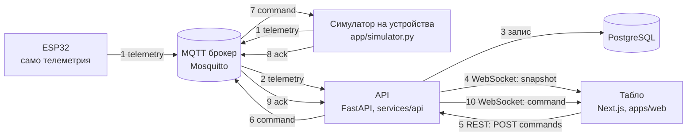

# OptiMesh — отчет за проекта

| | |
|---|---|
| Commit | `4fd76225f87297e80c7c72e54b616674008042c0` на `develop` (след PR #30) |
| Време | 2026-10-03, 15:25 UTC (18:25 българско време) |
| За кого | Митко и Даниел: слайдове и документация. Не е нужно да сте чели кода. |
| Как е направен | Изготвен от агент за код по задание на Стоян (GamingSimpwa). Проверете число, преди да го сложите на слайд. |
| Източници | [README.md](../README.md), [docs/contracts.md](contracts.md), [docs/frontend-handoff.md](frontend-handoff.md), [.github/project-plan.json](../.github/project-plan.json), кодът, `git log` и сливаните PR |

**Как да четете числата.** Всяко количество има етикет:

- **измерено**: командата е пусната сега, на този commit. Командата е дадена.
- **по отчет**: число на някой друг, което не е възпроизведено тук. Пише чие е.
- **допускане**: входна стойност, която никой не е измерил (константа в кода или в сценарий).

Номерата на issue и PR, портовете, UUID, версиите, датите и часовете са идентификатори. Те нямат етикет. Ако нещо липсва в репото, пише „не е намерено в репото“. Ако два източника си противоречат, печели кодът и това е казано.

---

## 0. Ако имаш две минути

1. OptiMesh е енергиен автопилот за един обект. Той мери, прогнозира слънце и цена и решава кога работи всяко устройство.
2. Работи цикълът в двете посоки: устройство → MQTT → API → PostgreSQL → WebSocket → табло и команда от таблото → устройство → потвърждение (ack). Проверено в CI.
3. ESP32 праща телеметрия по TLS до брокер на Raspberry Pi (по отчет: PR #22 на DGtao13). Команди ESP32 още не приема.
4. Има две симулации: `app/sim` в терминала (борсови цени, LP Autopilot) и игра в браузъра `/simulator` (без бекенд).
5. API отговаря на `/forecast`, `/costs` и `/recommendations`, но таблото още не ги показва.
6. Кандидат за главно число: един симулиран офисен ден струва 27,77 EUR без управление и 18,24 EUR с Autopilot, и в двата случая с 10 от 10 заредени коли (измерено: `uv run --frozen python -m app.sim.scenario_office`). Изборът е отворен, вижте раздел 7.
7. Три неща, които не твърдим:
   - универсални спестявания: това е един симулиран ден;
   - по-малко износване на батерията: Autopilot я цикли 0,80 срещу 0,21 пъти (измерено, същата команда);
   - безопасно публично внедряване: `/api/v1` няма автентикация, затова само в LAN.

---

## 1. Какво е OptiMesh и тезата за журито

**Тема:** „Енергията около нас“. **Слоган:** "Connect. Predict. Optimize."

**Какво е.** OptiMesh е софтуер за един обект: дом, работилница или офис. Той събира измервания от устройствата. Прогнозира слънцето и цената. Предлага или изпълнява кога да работи всяко устройство. Устройство е всичко, което говори договора v1: ESP32, симулатор или бъдещ адаптер.

**Проблемът.** Борсовата цена на тока се сменя на всеки 15 минути (по отчет: коментарът в `scenario_office.py` за 15-минутна резолюция). В сценария на `app/sim` за 30.09.2026 цената между 07:00 и 19:00 е от 9,66 до 231,48 EUR/MWh. Това е по отчет: цените са от api.energy-charts.info според коментара в [scenario_office.py](../services/api/app/sim/scenario_office.py), а тук не са сверени с източника. Един офис с 10 коли и 3 зарядни (допускане) може да зарежда по много начини. Кога зарежда решава сметката, пика и дали колите са готови навреме.

**Тезата за журито.**

1. Един договор за всички устройства. За платформата реален ESP32 и симулатор изглеждат еднакво (раздели 3 и 4).
2. При променлива цена планирането по прогноза намалява разхода, без да изпуска колите. В симулирания офисен ден: 27,77 → 18,24 EUR при 10/10 заредени коли (измерено, раздел 6).
3. Показваме и границите. При плоска тарифа печалба няма. Батерията се цикли повече. Публично внедряване още не е безопасно (раздел 8).

**Рамка на състезанието.** Всичко в тази таблица е по отчет: информационен пакет за участниците.

| Какво | Кога и колко |
|---|---|
| Първо демо | неделя 04.10, 10:00 |
| Предаване (слайдове + GitHub репо) | неделя 04.10, 12:30 |
| Полуфинал | 13:00; 7 мин представяне + 3 мин въпроси |
| Финал | 15:00; 10 мин представяне + 5 мин въпроси |
| Оценка | идея и проблем 25 %, иновация 25 %, техническо изпълнение 30 %, презентация 20 % |
| Бележка на журито | Чистото репо има значение: добри PR, клонове, етикети, README и принос от всеки член на екипа. |

---

## 2. Какво работи днес

„CI“ означава GitHub Actions, run 37133024265 на този commit: зелено (по отчет: GitHub Actions). „Пуснато сега“ означава, че командата е пусната на този commit.

| Функция | Къде в кода | Как е проверено | Какво липсва |
|---|---|---|---|
| Договор v1: телеметрия, команда, ack | `services/api/app/schemas.py`, `contracts/`, [docs/contracts.md](contracts.md) | CI; пуснато сега: `pytest` (`tests/test_contract.py`) | Съгласувани ACL на брокера; версия на WebSocket съобщенията (#2) |
| Приемане на телеметрия по MQTT и HTTP | `services/api/app/mqtt.py`, `app/platform.py`, `POST /api/v1/telemetry` | CI (тестове с PostgreSQL); пуснато сега: `pytest` без база | ACL по устройство се пазят на брокера, не в репото |
| MQTT по TLS | `app/config.py`, `app/mqtt.py`, `app/simulator.py` | CI (`tests/test_mqtt_tls.py`); с реалния Raspberry Pi: по отчет (README; PR #26 на DGtao13) | — |
| Живо табло по WebSocket | `app/api.py` (`/live`), `app/live.py`, `apps/web/src/hooks/use-site-live.tsx` | CI; в браузър: по отчет ([frontend-handoff.md](frontend-handoff.md), unkownshadows) | Няма автентикация; съобщенията нямат версия |
| Команди с потвърждение | `app/platform.py`, `app/api.py`, `apps/web/src/components/device-list.tsx` | CI; кръгът в браузър: по отчет (frontend-handoff.md) | Автентикация, `requested_by`, блокировки, ръчно предимство (#8) |
| Симулатор на устройства по MQTT | `services/api/app/simulator.py` | Не е пускан сега (няма брокер на тази машина); по отчет (README, frontend-handoff.md) | — |
| ESP32 фърмуер | [firmware/esp32-telemetry/](../firmware/esp32-telemetry/README.md) | По отчет (PR #22 на DGtao13: телеметрия на около всеки 5 s през TLS до Mosquitto на Raspberry Pi). CI не го компилира. | Не приема команди, не праща ack, не управлява изход (GPIO). Мощността е постоянна симулирана стойност. |
| Табло: портфолио, сайт, устройства, лог на команди, графика на мощността | `apps/web/src/app`, `apps/web/src/components` | CI; пуснато сега: lint, typecheck, `npm test`, build | Текстовете са на английски, а решението на екипа е български; клавиатурна проверка не е записана (#7) |
| Прогноза, разходи, препоръки (API) | `app/insights.py`, `forecast.py`, `costs.py`, `recommendations.py`, `tariff.py` | CI (`tests/test_insights_db.py` с база); пуснато сега: `tests/test_insights.py` | Таблото не ги показва; тарифата е измислена демо тарифа |
| Сценарий за цял ден и LP Autopilot | `services/api/app/sim/` | Пуснато сега: `python -m app.sim.scenario_office` и `tests/test_sim.py` | Няма API и няма екран; климатикът е част от постоянния товар |
| Игра `/simulator` | `apps/web/src/sim/`, `apps/web/src/components/simulator/` | Пуснато сега: `npm test`; `next start` и `GET /simulator` → 200 без бекенд. Не е минавана в браузър сега. | Autopilot тук е набор от правила, не LP; текстовете са на английски |
| `/sites`: създаване на сайт и устройство, история, Supabase JWT | `app/auth.py`, `app/registry.py`, `app/history.py` | CI (`test_auth.py`, `test_registry.py`, `test_history.py`) | `/api/v1` е без проверка (#3); няма екран за вход |
| Миграции `0001 → 0002 → 0003` | `services/api/alembic/versions/` | CI: `upgrade`, `check`, `downgrade`, `upgrade` | — |
| CI на всеки PR | `.github/workflows/ci.yml` | Последният run на `develop` е зелен (по отчет: GitHub Actions) | Няма внедряване (#15) |

**Проверките на този commit** (всички числа в блока са измерени, около 15:25 UTC):

```text
# корен на репото
npm run lint && npm run typecheck && npm test && npm run build
→ lint и typecheck без грешки; Test Files 9 passed (9); Tests 74 passed (74); build: Compiled successfully

# services/api
uv sync --frozen --python 3.12
uv run --frozen ruff check .           → All checks passed!
uv run --frozen ruff format --check .  → 47 files already formatted
uv run --frozen mypy app               → Success: no issues found in 29 source files
uv run --frozen pytest -q              → 235 passed, 45 skipped, 1 warning
```

Пропуснатите 45 теста (измерено) са тестовете с база. Те вървят само при зададен `TEST_DATABASE_URL`. В CI вървят с PostgreSQL 17: там backend дава 305 passed, а frontend 74 passed (по отчет: GitHub Actions, run 37133024265).

---

## 3. Архитектура



Стъпки 1–4 са пътят от устройството до таблото. Стъпки 5–10 са пътят на командата обратно. ESP32 участва само в стъпка 1, защото фърмуерът не приема команди. Обратния път днес го минава симулаторът.

**Компоненти**

- `firmware/esp32-telemetry`: фърмуер за ESP32 (ESP-IDF). Праща телеметрия по MQTT с TLS.
- `services/api/app/simulator.py`: виртуални устройства. Пращат телеметрия и отговарят на команди с ack по същия договор.
- MQTT брокер: Mosquitto. Локално е в `compose.yaml`, без парола и само на 127.0.0.1. За хардуера е на Raspberry Pi с TLS (по отчет: README).
- `services/api/app/mqtt.py`: мост между MQTT и API. Приема телеметрия и ack и изпраща команди.
- `services/api/app/platform.py`: ядрото. Проверява, записва, пази последното състояние и води командите.
- `services/api/app/api.py`: REST под `/api/v1` и WebSocket `/api/v1/sites/{site_id}/live`.
- `services/api/app/insights.py`: прогноза, разходи и препоръки за сайт.
- `services/api/app/registry.py` и `auth.py`: маршрутите `/sites` с проверка на Supabase JWT.
- PostgreSQL: сайтове, устройства, измервания и команди. Схемата се води с Alembic.
- `apps/web`: таблото. Портфолио, страница на сайт, лог на команди и играта `/simulator`.
- `services/api/app/sim`: симулация на цял ден в паметта и LP Autopilot. Няма API и екран.
- `apps/web/src/sim`: отделна симулация на TypeScript за играта. Работи само в браузъра.

**Технологии**

- Frontend: Next.js 16, React 19, TypeScript, Tailwind CSS 4, vitest.
- Backend: Python 3.12, FastAPI, SQLAlchemy, Alembic, psycopg, pydantic, aiomqtt, PyJWT, uv.
- Оптимизация: numpy и scipy (`linprog` с решател HiGHS).
- База: PostgreSQL 17 локално и в CI; Supabase при хостване (README).
- Брокер: Mosquitto 2.
- Фърмуер: ESP-IDF 5.3.1 през PlatformIO (`espressif32@6.9.0`).
- CI: GitHub Actions с две задачи, `frontend` и `backend`. CodeRabbit прави преглед на PR.

---

## 4. Договорът накратко

Източник: [docs/contracts.md](contracts.md). Там, където кодът казва друго, е отбелязано.

**Теми (topics)**

```text
optimesh/v1/sites/{site_id}/devices/{device_id}/telemetry   устройство → платформа
optimesh/v1/sites/{site_id}/devices/{device_id}/command     платформа → устройство
optimesh/v1/sites/{site_id}/devices/{device_id}/ack         устройство → платформа
```

Флагът retain не се ползва. Всяко устройство слуша само своята тема `command`.

Числата в JSON примерите по-долу са примерни стойности от docs/contracts.md (допускане), не измервания.

**Телеметрия** (устройство → платформа):

```json
{
  "version": 1,
  "site_id": "5e000000-0000-4000-8000-000000000002",
  "device_id": "de000000-0000-4000-8000-000000002003",
  "message_id": "6f1c2a8e-3b7d-4c51-9a0e-2d4b8f7e1c33",
  "observed_at": "2026-10-02T18:00:00Z",
  "metrics": { "power_w": 58.4, "energy_wh": 125.7, "voltage_v": 229.6, "current_a": 0.254 },
  "state": { "on": true }
}
```

- `message_id` е нов UUID за всяко съобщение. Повторно изпратено съобщение се игнорира, затова повторите са безопасни.
- Нужно е поне едно от `power_w`, `energy_wh` и `soc_pct`.
- Непознато поле прави съобщението невалидно.

**Команда** (платформа → устройство):

```json
{
  "version": 1,
  "command_id": "44444444-4444-4444-8444-444444444444",
  "issued_at": "2026-10-02T18:00:00Z",
  "expires_at": "2026-10-02T18:00:15Z",
  "type": "switch",
  "params": { "on": false }
}
```

Типовете са `switch` (`{"on": true|false}`) и `power_setpoint` (`{"power_w": ≥ 0}`, като 0 означава спри). Бекендът проверява способността (capability) и границите на устройството, преди да прати командата.

**Потвърждение (ack)** (устройство → платформа):

```json
{ "version": 1, "command_id": "44444444-4444-4444-8444-444444444444", "status": "applied", "reason": null, "observed_at": "2026-10-02T18:00:00.350Z" }
```

`status` е `applied` или `rejected`. Пътят на командата е `pending` → `sent` → `applied` / `rejected`. Без ack командата става `expired`, а `failed` значи, че брокерът е недостъпен. `sent` значи само, че брокерът е приел командата. Това не е потвърждение от устройството.

**Единици.** Мощност във W, енергия в Wh, заряд на батерията `soc_pct` от 0 до 100, време в UTC.

**Знаци на `power_w`**

| Вид устройство | Положително означава |
|---|---|
| `grid_meter` | внос от мрежата (износът е отрицателен) |
| `solar_inverter` | производство |
| `battery` | зареждане (разреждането е отрицателно) |
| всички останали (`load`, `smart_plug`, `boiler`, `hvac`, `ev_charger`) | консумация |

**Времеви прозорци.** Всички стойности са зададени в кода или в договора, никой не ги е мерил.

| Правило | Стойност | Къде | Етикет |
|---|---|---|---|
| `observed_at` не по-старо от | 24 h | `app/platform.py`, `MAX_PAST_AGE` | допускане |
| `observed_at` не по-напред в бъдещето от | 5 min | `app/platform.py`, `MAX_CLOCK_SKEW` | допускане |
| Устройството е offline след | 15 s без данни | `app/config.py`, `device_stale_after_s` | допускане |
| Командата изтича след | 15 s | `app/config.py`, `command_ttl_s` | допускане |
| WebSocket праща snapshot поне на всеки | 5 s | `app/api.py`, `SNAPSHOT_REFRESH_S` | допускане |
| Препоръчана честота на телеметрия | 2–5 s | docs/contracts.md, §4 | допускане |
| ESP32 публикува на всеки | 5000 ms | `firmware/esp32-telemetry/include/config.example.h` | допускане |
| Дължина на `reason` в ack | до 200 знака | `app/schemas.py` | допускане |

Двете граници за `observed_at` са включени. Извън тях телеметрията се отхвърля.

**Къде docs/contracts.md и кодът се разминават (печели кодът)**

| docs/contracts.md казва | Кодът казва |
|---|---|
| Брокер `<laptop-ip>:1883`, обикновен MQTT, без парола (§1) | По подразбиране `MQTT_PORT=8883` и `MQTT_TLS=true` (`app/config.py`). Обикновен MQTT е разрешен само за брокер без парола на `localhost`, `127.0.0.1`, `::1` или `mqtt`. Брокер без TLS на IP адреса на лаптоп в LAN се отказва. |
| ESP32 с PubSubClient и QoS 0 (§7) | Фърмуерът е на ESP-IDF с вградения ESP-MQTT клиент, QoS 1 и TLS ([firmware README](../firmware/esp32-telemetry/README.md)). |
| ESP32 се флашва с UUID от `app/seed.py`: Workshop / „ESP32 demo load“ (§2) | README дава проверената тема на Raspberry Pi с други UUID (`0e708814-…`, `42c485b1-…`), които не са в `app/seed.py`. За да се види ESP32 в таблото, неговите UUID трябва да са регистрирани в базата, която ползва API. |
| Таблицата „Frontend API“ не съдържа прогноза, разходи и препоръки | `app/api.py` има `GET /api/v1/sites/{site_id}/forecast`, `/costs` и `/recommendations` (PR #30). |

---

## 5. Демото в три действия

Всяка стъпка е отбелязана с **[пуснато сега]** или **[не е пускано]**. На машината, на която е писан отчетът, няма Docker. Затова действие 1 не е пускано.

### Действие 1: Connect (устройства → табло → команда → ack)

**Команди** (от корена на репото, по README). **[не е пускано]**

```sh
docker compose up -d db mqtt                                      # PostgreSQL + Mosquitto
cd services/api && cp .env.example .env && uv sync --frozen --python 3.12
uv run --frozen alembic upgrade head && uv run --frozen python -m app.seed
uv run --frozen uvicorn app.main:app --reload                     # API на :8000
uv run --frozen python -m app.simulator --include-hardware        # виртуални устройства, вкл. ESP32
npm ci && npm run dev                                             # табло на :3000 (корен на репото)
```

- `--include-hardware` кара симулатора да играе и ролята на ESP32. С `--hour 12` слънцето е като по обед (README).
- **Windows:** README казва да оставите `--reload` на командата за API. Без него uvicorn ползва Proactor event loop, на който MQTT клиентът не работи. README не дава Windows вариант на `cp`; в PowerShell `cp` е псевдоним на `Copy-Item`.
- **Реалният ESP32** минава само през брокера на Raspberry Pi с TLS. API трябва да е настроен в `services/api/.env` по раздела „MQTT over TLS“ в README, а UUID на платката трябва да са в базата (раздел 4). За този път README дава отделна команда за Windows, с една инстанция и без `--reload`: **[не е пускано]**

  ```powershell
  python -c "import asyncio,uvicorn; asyncio.set_event_loop_policy(asyncio.WindowsSelectorEventLoopPolicy()); uvicorn.run('app.main:app',loop='asyncio',workers=1)"
  ```

**Адреси:**

- http://localhost:3000: портфолио с Home, Workshop и Office.
- http://localhost:3000/sites/5e000000-0000-4000-8000-000000000002: Workshop.
- http://localhost:3000/sites/5e000000-0000-4000-8000-000000000003: Office.
- http://127.0.0.1:8000/docs: описанието на API.
- http://127.0.0.1:8000/api/v1/status: `{"mqtt": "connected" | "disconnected" | "disabled"}`.

**Какво вижда публиката.**

- Три обекта с живи стойности.
- В обекта: плочки „Solar / Grid / Consumption / Battery“, анимиран поток на енергията и списък с устройства.
- Включвате „Compressor“ в Workshop. Редът показва „Waiting for device…“. После в лога на командите се появява `Applied`.

**Изречение:** „Командата става „Applied“ едва когато устройството я потвърди. Това, че брокерът я е приел, не е потвърждение.“

**Ако нещо падне**

- **Хардуерът:** симулаторът с `--include-hardware` поема UUID на ESP32. Таблото не вижда разлика.
- **Интернетът:** всичко върви на `localhost`, защото `compose.yaml` слуша само на 127.0.0.1.
- **Docker или базата:** без база API връща 503 за `/api/v1/sites` и `/ready`, а `/health` е 200. **[пуснато сега]** на порт 8100 без база: `/health` → `{"status":"ok",…}`, `/api/v1/sites` → `{"detail":"Database unavailable"}`, `/api/v1/status` → `{"mqtt":"disabled"}`. В такъв случай минете направо на действие 3.
- **Пусната платка:** ако платката е в Workshop и щракнете ключа ѝ, командата ще стане `expired`, защото фърмуерът не приема команди. Показвайте ключа на устройство от симулатора.

### Действие 2: Predict (прогноза и цена)

**Вариант А: без база и без мрежа.** **[пуснато сега]**

```sh
cd services/api
uv run --frozen python -m app.sim.scenario_office
```

Публиката вижда три реда: без управление, Autopilot и „оптимум (знае бъдещето)“ (изходът е в раздел 6). Редът „оптимум“ е същият планировчик, но с перфектна прогноза. Разликата 18,24 − 17,48 = 0,76 EUR (измерено, сметнато от изхода) е колкото струва несигурността в прогнозата в този сценарий. Командата е същата и на Windows; README не дава друга.

**Вариант Б: с работещ API и база от действие 1.** **[не е пускано]**

```sh
curl http://127.0.0.1:8000/api/v1/sites/5e000000-0000-4000-8000-000000000003/forecast
```

- Връща 24 часови интервала (допускане: константа в `app/forecast.py`): очаквано слънце, товар, цена за внос и износ, часова зона, валута и списък с допускания на български.
- Таблото няма раздел „Прогноза“. Покажете отговора в http://127.0.0.1:8000/docs с „Try it out“.

**Изречение:** „Autopilot вижда прогнозата и текущото измерване, не бъдещето. Облакът в 12:30 го изненадва и той препланира на всяка стъпка от 15 минути.“ (Стъпката е допускане на сценария.)

**Ако нещо падне.** Вариант А не иска база, брокер или интернет. Ако лаптопът откаже, покажете на слайд изхода от раздел 6.

### Действие 3: Optimize (играта)

**Команди** (корен на репото):

```sh
npm ci && npm run dev          # после http://localhost:3000/simulator
```

Друг вариант е production сборка: `npm run build`, после `cd apps/web && npx next start -p 3000`.

- **[пуснато сега]** `npm run build` и `npx next start -p 3100` в `apps/web`, без бекенд: `GET /simulator` → 200, със заглавие „Simulator · OptiMesh“ и текста „Get every car charged before its driver leaves.“
- **[не е пускано]** Самата игра не е минавана с мишка в браузър при изготвянето на отчета.

**`/simulator` не иска бекенд.** Кодът в `apps/web/src/sim` и `components/simulator` не вика API. Страничното меню все пак пита `/api/v1/sites` на всеки 3 s (допускане: `POLL_MS` в `use-sites.tsx`). Без бекенд долу пише „API unreachable“. Това е очаквано.

**Какво вижда публиката.**

1. Въведение с таблица „Today's cars“ и бутони „Start the day“ и „Watch Autopilot first“.
2. Ръчен ден: включвате колите в 3 зарядни (допускане).
3. Autopilot преиграва същия ден.
4. Таблица с резултати „You / Simple rules / Autopilot“: разход, пик на вноса, коли навреме. Под нея пише: „These are simulation results. They do not claim the same savings for any real site or hardware.“

**Изречение:** „Същият ден и същите коли: Autopilot зарежда всичките 10 навреме и държи пика до 22 kW, а простите правила оставят 3 коли незаредени.“ Тези числа са измерени чрез тестовете, при seed 7 (раздел 6).

**Ако нещо падне.** След `npm ci` играта не иска интернет, бекенд или хардуер. Приложението не тегли шрифтове и скриптове отвън.

---

## 6. Числата

### 6.1 Сценарият `app/sim`: един офисен ден

Изход от командата, пусната сега (измерено):

```text
$ cd services/api && uv run --frozen python -m app.sim.scenario_office
Офис с 10 електромобила: 48 steps of 15 min
no management                 27.77 EUR | import  170.9 kWh | peak 30.0 kW | cars ready 10/10 | battery cycles 0.21 | 1 ms
Autopilot                     18.24 EUR | import  178.7 kWh | peak 30.0 kW | cars ready 10/10 | battery cycles 0.80 | 135 ms
optimum (knows the future)    17.48 EUR | import  184.5 kWh | peak 30.0 kW | cars ready 10/10 | battery cycles 0.96 | 129 ms
```

Милисекундите в края на редовете са времето за изчисление на тази машина. Те не са твърдение за продукта.

| Стойност | Какво значи | Команда | Етикет |
|---|---|---|---|
| 27,77 EUR | Цена на деня без управление: първа дошла, първа зарежда, на пълна мощност | `uv run --frozen python -m app.sim.scenario_office` (в `services/api`) | измерено |
| 18,24 EUR | Цена на деня с Autopilot | същата | измерено |
| 17,48 EUR | Цена, ако планировчикът знае бъдещето; само за сравнение | същата | измерено |
| 9,53 EUR и 34,3 % | Спестено от Autopilot спрямо без управление: (27,77 − 18,24) / 27,77 | сметнато от изхода | измерено |
| 92,6 % | Каква част от възможното спестяване взима Autopilot: (27,77 − 18,24) / (27,77 − 17,48) | сметнато от изхода | измерено |
| 10/10 | Заредени навреме коли и в трите реда | същата | измерено |
| 30,0 kW | Пик на вноса и в трите реда, равен на лимита на връзката. **Пикът не пада.** | същата | измерено |
| 170,9 / 178,7 / 184,5 kWh | Внос от мрежата. **Autopilot внася повече**, но в по-евтини часове. | същата | измерено |
| 0,21 / 0,80 / 0,96 | Цикли на батерията. **Autopilot я цикли около 4 пъти повече.** | същата | измерено |
| 12,6 / 48,0 kWh | Енергия през батерията без управление / с Autopilot: цикли × 2 × 30 kWh | сметнато от изхода | измерено |
| 27,77 ±0,01; 18,24 ±0,05; 17,48 ±0,05 EUR | Тестът `test_office_day_reference_numbers` пази тези стойности | `uv run --frozen pytest -q tests/test_sim.py` → 13 passed | измерено |

### 6.2 Играта в браузъра (`apps/web/src/sim`)

Резултатите са от тестовете. Тестовете проверяват граници и отношения, а не точни суми. Команда: `npm test` от корена → 74 passed (измерено). Само тестовете на играта: `npx vitest run --root apps/web src/sim` → 46 passed в 5 файла (измерено).

| Стойност | Какво значи | Тест | Етикет |
|---|---|---|---|
| 10/10 | Autopilot зарежда всички коли навреме, при seed 7, 1 и 42 | `policies.test.ts` | измерено |
| ≤ 22 kW | Пик на вноса с Autopilot (`PEAK_CAP_W`), при seed 7, 1 и 42 | `policies.test.ts` | измерено |
| > 28,6 kW | Пик на вноса с простите правила: над 1,3 × 22 kW, при seed 7, 1 и 42 | `policies.test.ts` | измерено |
| по-малко от простите правила | Разход на Autopilot, коригиран за крайния заряд на батерията; без сума | `policies.test.ts` | измерено |
| 7/10 | Простите правила зареждат навреме 7 коли, при seed 7 | `view.test.ts` | измерено |
| < 0,25 °C·h и 0 | Отклонение от комфорта и интервали с претоварване при Autopilot | `policies.test.ts` | измерено |
| 420 | Съобщения телеметрия за един ден: 60 интервала × 7 устройства | `telemetry.test.ts` | измерено |
| 32–35 kW | Пик на простите правила | няма тест с това число | по отчет ([frontend-handoff.md](frontend-handoff.md), unkownshadows) |
| 9–11 % | Колко по-евтин е Autopilot | няма тест с това число | по отчет (frontend-handoff.md, unkownshadows) |
| 420/420 | Съобщения, проверени срещу `app.schemas.Telemetry` в Python | в репото няма такъв тест; TS тестът проверява само имената на полетата | по отчет (frontend-handoff.md, unkownshadows) |

### 6.3 Числа без команда в репото

Тези три числа идват от предишен чат. В репото няма команда или тест, който да ги печата. **Не ги слагайте на слайд, докато не бъдат възпроизведени с команда от репото.**

| Стойност | Какво значи | Какво проверява тестът в репото | Етикет |
|---|---|---|---|
| 25,51 EUR, 8/10 коли | Човек с едно правило в `app/sim` | `test_one_simple_rule_is_not_enough`: само че не зарежда всички коли и излиза по-скъпо от Autopilot | по отчет (предишен чат), не е възпроизведено |
| 21,83 EUR | Autopilot без батерия | няма тест | по отчет (предишен чат), не е възпроизведено |
| 34,23 срещу 34,35 EUR | Плоска тарифа: Autopilot срещу без управление | `test_flat_tariff_gives_no_meaningful_saving`: само че разликата е в рамките на 2 % (допускане: `rel=0.02` в теста) | по отчет (предишен чат), не е възпроизведено |

### 6.4 Входни стойности

Всички входни стойности са в раздел 7, в таблицата за двата сценария.

---

## 7. Кое число на кой слайд

`app/sim` и играта са **различни сценарии**. Числата им никога не стоят на един слайд и не се сравняват помежду си.

| | `app/sim` (терминал) | Игра `/simulator` (браузър) | Етикет |
|---|---|---|---|
| Ден и часове | 30.09.2026, 07:00–19:00 | 17.06.2026, 06:00–21:00 | идентификатори |
| Стъпки | 48 × 15 мин | 60 × 15 мин | допускане |
| Цена за внос | борсовата цена + 0,07 EUR/kWh такси | измислена тарифа по часови зони, 0,11–0,32 EUR/kWh | борсовата цена: по отчет (energy-charts.info, според коментара в кода); останалото: допускане |
| Цена за износ | 0,9 × борсовата цена | 0,06 EUR/kWh | допускане |
| Слънце | 45 kWp × 0,68 (пик на прогнозата 30,6 kW); облак 12:30–14:15 до 30 % от прогнозата | пик 30 kW; облаци според seed | допускане |
| Батерия | 30 kWh, 15 kW, заряд 10–100 %, старт 30 % | 50 kWh, 25 kW, заряд 10–95 %, старт 40 % | допускане |
| Връзка с мрежата | 30 kW | внос 50 kW, износ 25 kW; Autopilot цели пик 22 kW | допускане |
| Коли | 10 коли по 11 kW, 3 зарядни | 10 коли по 7,4–11 kW, 3 зарядни | допускане |
| Климатик | част от постоянния товар | управляем, комфорт 21–25 °C | допускане |
| Autopilot | линейно програмиране с плъзгащ се хоризонт | набор от правила | — |
| Сравнява се с | без управление и „оптимум (знае бъдещето)“ | вашата игра и „прости правила“ | — |

Източници: [scenario_office.py](../services/api/app/sim/scenario_office.py), [core.py](../services/api/app/sim/core.py), [scenario.ts](../apps/web/src/sim/scenario.ts), [policies.ts](../apps/web/src/sim/policies.ts).

### Двата варианта за главно число

| | Вариант A: `app/sim` в EUR | Вариант B: играта в коли и пик |
|---|---|---|
| Число | 27,77 → 18,24 EUR за деня, 10/10 коли и в двата случая (измерено) | 10/10 срещу 7/10 коли навреме; пик ≤ 22 kW срещу > 28,6 kW (измерено, seed 7) |
| Може да подкрепи | Спестяване в пари при реални борсови цени. Една команда го дава, а тест го пази. Сравнението с „оптимум“ показва колко близо е Autopilot: 92,6 % от възможното (измерено). | Това, което публиката вижда на живо. Сроковете на колите и пика. Работи без бекенд. |
| Не може да подкрепи | По-нисък пик (30,0 kW и в трите реда). По-малко внос (Autopilot внася повече). По-малко износване. Нещо извън този един ден и тези допускания. Нищо от това не се вижда в UI. | Сума или процент в пари: тестовете казват само „по-евтино“, а 9–11 % е по отчет. Реални цени: тарифата е измислена. Оптимизатор: Autopilot тук е набор от правила. |

**Препоръка.** Вариант A като главно число на слайда за резултата. Той е възпроизводим с една команда, пазен от тест и стъпва на реални цени. Вариант B е за демото и за отделен слайд, само с коли и пик и без EUR. На слайда за A напишете с малък шрифт: „симулиран ден, 30.09.2026, борсови цени за България, допуснати товари и коли“.

**ОТВОРЕНО: решава Стоян.**

---

## 8. Какво не твърдим

| Не твърдим | Защо |
|---|---|
| Универсални спестявания | 18,24 срещу 27,77 EUR (измерено) е един симулиран ден с допуснати товари, коли и такси (раздели 6 и 7). Не е измерване на реален обект. |
| По-малко износване на батерията | Autopilot цикли батерията 0,80 пъти срещу 0,21 без управление (измерено). През нея минават 48,0 срещу 12,6 kWh (измерено, сметнато). Разходът в резултата не включва износване. Планировчикът брои 0,02 EUR/kWh за износване (допускане: `Battery.wear_eur_per_kwh`). |
| По-нисък пик в `app/sim` | Пикът е 30,0 kW и в трите реда (измерено). По-нисък пик има само в играта, която е друг сценарий. |
| По-малко внос от мрежата в `app/sim` | Autopilot внася 178,7 kWh срещу 170,9 kWh (измерено). Той внася повече, но по-евтино. |
| Полза при плоска тарифа | Тестът `test_flat_tariff_gives_no_meaningful_saving` проверява, че разликата е в рамките на 2 % (допускане: `rel=0.02`; измерено: тестът минава). Сумите 34,23 и 34,35 EUR са по отчет (предишен чат), не са възпроизведени. |
| Autopilot за хардуер | Autopilot съществува само в двете симулации. Таблото дава само ръчни ключове и граници на мощност. `/recommendations` само предлага команди и не изпраща нищо. ESP32 не приема команди. |
| Безопасно публично внедряване | `/api/v1`, WebSocket и командите нямат автентикация. Всеки, който стигне до API, чете всички обекти и праща команди. Само `localhost` или доверен LAN. Внедряване няма (#15). |

---

## 9. Ограничения и сигурност

**Какво не е направено**

- Автентикация на `/api/v1`, WebSocket и командите (#3). Само `/sites` проверява Supabase JWT и собственика.
- Внедряване на таблото и API (#15).
- Раздели „Прогноза“ и „Разходи“ в таблото. API ги има (PR #30), но таблото не ги вика.
- API и екран за `app/sim`. Играта ползва своя симулация на TypeScript.
- Режими Monitor и Assist в таблото (#10).
- Команди и ack на ESP32 (#9). Фърмуерът е само за телеметрия с постоянна симулирана мощност.
- Втори адаптер за устройство (#18).
- Текстовете в таблото са на английски. Решението на екипа е български. Само текстовете от API за прогноза и препоръки са на български.
- Описание на нужното споделяне на събития при няколко работни процеса на API: не е намерено в репото (#6).

**MQTT и TLS** (от `app/config.py`, `app/mqtt.py` и README)

- TLS е включен по подразбиране. API проверява сертификата и името на брокера. Иска TLS 1.2 или по-нов. Няма настройка, която да изключи проверката.
- Липсващ или нечетим `MQTT_CA_FILE` спира API при старт. CA без `MQTT_TLS=true` се отказва, за да не тръгне парола в чист текст.
- Обикновен MQTT е разрешен само за локален брокер без парола (`localhost`, `127.0.0.1`, `::1` или услугата `mqtt`).
- Паролите и съдържанието на съобщенията не се пишат в логовете.
- ACL по устройство (кой какво може да публикува) се настройват на брокера на Raspberry Pi. Конфигурацията му не е намерена в репото.
- Локалният брокер в `compose.yaml` е без парола и слуша само на 127.0.0.1.

**База данни** (по README): таблиците са в схема `optimesh`, а достъпът до схема `public` е отнет. `.env` файловете и тайните не се качват в Git.

**Допусканията в сценариите** са в таблицата в раздел 7. Най-важните:

- Товарите, колите, покривът, таксите (0,07 EUR/kWh) и батерията в `app/sim` са допускания. Прегледът им е предстоящ според коментара в `scenario_office.py`.
- Облакът в `app/sim` е зададен. Прогнозата не го вижда нарочно.
- Тарифата в играта и в `/forecast` / `/costs` е измислена демо тарифа (`app/tariff.py`). Не е тарифа на доставчик.
- Прогнозата за слънце в API е крива на ясно небе × мощност на инвертора × 0,85 (допускане). Прогнозата за товар е средното за седмицата по час или текущата консумация.

---

## 10. Срещу критериите на журито

Тежестите са по отчет: информационен пакет за участниците.

| Критерий | Три най-силни факта |
|---|---|
| Идея и проблем (25 %) | 1. Цената в сценария се движи от 9,66 до 231,48 EUR/MWh в рамките на един работен ден (по отчет: energy-charts.info; раздел 1). 2. В играта простите правила зареждат навреме 7 от 10 коли (измерено; раздел 6.2). 3. Казваме и кога няма полза: при плоска тарифа (раздел 8). |
| Иновация (25 %) | 1. Един договор за хардуер и симулатор; платформата не ги различава (раздели 3 и 4). 2. Autopilot е LP с плъзгащ се хоризонт, който не вижда бъдещето, а тест го доказва (`test_autopilot_cannot_see_the_future`; раздел 11, въпрос 3). 3. Сравнение с „оптимум, който знае бъдещето“: Autopilot взима 92,6 % от възможното спестяване (измерено; раздел 6.1). |
| Техническо изпълнение (30 %) | 1. Цикъл в двете посоки с ack, в който `Applied` идва само от устройството; CI с 305 backend и 74 frontend теста е зелен (по отчет: GitHub Actions; раздел 2). 2. MQTT с проверен TLS, а ESP32 праща към брокер на Raspberry Pi (по отчет: PR #22; раздели 2 и 9). 3. Детерминирани симулации с тестове за запазване на енергията и границите, плюс миграции с проверка напред и назад в CI (раздели 2 и 6). |
| Презентация (20 %) | 1. Демо в три действия с резервен план за всяко (раздел 5). 2. Играта върви без бекенд и без интернет (пуснато сега; раздел 5). 3. Чисто репо: шаблон за PR, етикети, milestones, CI на всеки PR, принос от четири акаунта (измерено: `git log`; раздел 12). |

---

## 11. Очаквани въпроси от журито

1. **Колко спестявате?** В един симулиран офисен ден разходът пада от 27,77 на 18,24 EUR, с 34,3 % (измерено), при борсовите цени за България от 30.09.2026. Товарите и колите са допуснати, затова това не е обещание за всеки обект. При плоска тарифа печалба няма (раздел 8).
2. **Работи ли с истински хардуер?** ESP32 праща телеметрия по TLS до Mosquitto на Raspberry Pi (по отчет: PR #22). Команди още не приема. Обратния път показваме със симулатора, който говори същия договор.
3. **Откъде знаете, че Autopilot не „вижда“ бъдещето?** Той чете реалното слънце само за текущата стъпка. Тестът `test_autopilot_cannot_see_the_future` променя бъдещето и проверява, че първите 10 решения (допускане: брой стъпки в теста) не се сменят. Редът „оптимум“ е същият планировчик с перфектна прогноза, само за сравнение.
4. **По-добре ли е от просто правило?** В играта простите правила зареждат навреме 7 от 10 коли, а Autopilot всичките 10, при пик до 22 kW (измерено чрез тестовете, seed 7). Това е отделен сценарий от `app/sim`. Числата за човек с едно правило в `app/sim` още не са възпроизведени.
5. **Пада ли пикът?** В `app/sim` не: пикът е 30,0 kW и в трите реда (измерено). В играта Autopilot държи пика до 22 kW, а простите правила минават 28,6 kW (измерено чрез тестовете). Това са два различни сценария.
6. **Не износвате ли батерията повече?** Да, Autopilot я цикли 0,80 пъти срещу 0,21 (измерено). Планировчикът брои цена за износване, но резултатът в EUR не я включва. Затова не твърдим по-малко износване.
7. **Сигурно ли е?** MQTT към Raspberry Pi е с TLS, проверка на сертификата и отделни пароли. REST API под `/api/v1` и WebSocket още нямат автентикация, затова работят само в LAN. Маршрутите `/sites` проверяват Supabase JWT.
8. **Как добавяте ново устройство?** Регистрирате го (`POST /sites/{site_id}/devices` или в `app/seed.py`). После то праща JSON по договор v1 на своята тема. Как ще се свързват Zigbee и чужди устройства е отворен въпрос 5 в [docs/contracts.md](contracts.md).
9. **Откъде е прогнозата?** `/forecast` смята слънцето като крива на ясно небе × мощност на инвертора × 0,85 (допускане). Товарът е средното за последната седмица по час, а ако няма история, текущата консумация. Отговорът изброява допусканията си. Машинно обучение няма.
10. **Какво става, ако падне интернетът?** Целият стек върви на `localhost`. Играта `/simulator` не иска бекенд (пуснато сега). Сценарият в терминала не иска нито база, нито мрежа.

---

## 12. Кой какво направи

Източник: `git log` на този commit и сливаните PR. Репото не свързва имена с потребители в GitHub. Имената стоят само в редовете „Suggested coordination“ на issue-тата. Затова тук са само потребителските имена.

Брой commits без merge commits (измерено: `git log --no-merges --format=%an | sort | uniq -c`):

| Автор в git | Commits | Етикет |
|---|---|---|
| Praz40 | 15 | измерено |
| GamingSimpwa | 8 | измерено |
| DGtao13 | 5 | измерено |
| baihui11 (акаунт unkownshadows в GitHub) | 5 | измерено |
| Claude | 4 | измерено |

| Потребител | Сливани PR | Основно |
|---|---|---|
| Praz40 | #1, #20 | Основата: FastAPI, Next.js, модели и миграция `0001`, CI, скрипт за backlog, CodeRabbit (#1). Регистър, история и проверка на Supabase JWT за `/sites` (#20). Собственик на репото. |
| unkownshadows | #21 и пет commits в #28 | Живият цикъл: договор v1 за команда и ack, MQTT мост, WebSocket, команди, табло, seed, симулатор на устройства (#21). Обвивка и табло, играта `/simulator`, поправка за Windows, модули за тарифа, прогноза, разходи и препоръки, документът за предаване (commits в #28). |
| DGtao13 | #22, #26, #27 | Фърмуер за ESP32 с телеметрия по TLS (#22). Приемане на MQTT телеметрия с TLS, прозорец за свежест и ограничени повтори (#26). Сливането `develop → main` (#27). PR #19 (договор за команди) е затворен, без сливане. |
| GamingSimpwa | #23, #24, #25, #28, #29, #30 | Синхронизация на `develop` с `main` и една верига миграции, CLAUDE.md и CONTRIBUTING.md (#23). `app/sim` и LP Autopilot (#24). Проверен TLS за MQTT моста (#25). Предаване на клона с работата на unkownshadows (#28). Причини за прекъсване на MQTT в логовете (#29). Маршрути за прогноза, разходи и препоръки (#30). |

**Четирите commits с автор „Claude“** (`8887d97`, `da4e579`, `3ba465d`, `cbf32e4`) са от 03.10, 10:26 UTC (13:26 българско време). Те са договор v1 за команда и ack, живият цикъл в API, таблото и документът за хардуера. Пренесени са с PR #21, отворен и слят от unkownshadows в `main`.

---

## 13. Статус на issue #2–#18

Статусът е по кода на този commit. Issue #14 е изпълнено в кода, но е още отворено: PR #28 е слят в `develop`, а GitHub затваря issue само при сливане в `main`.

| Issue | Заглавие | Статус | Доказателство |
|---|---|---|---|
| #2 | Freeze telemetry, MQTT and command contracts | частично | Схемите, примерите и тестовете на договора са налице (`contracts/`, `tests/test_contract.py`). ACL не са съгласувани, а WebSocket съобщенията нямат версия. |
| #3 | Supabase Auth and site authorization | частично | `app/auth.py` проверява подпис, issuer, audience и срок, но само за `/sites`. `/api/v1`, WebSocket и командите са без проверка. |
| #4 | Site/device registry and measurement history | затворено; частично в кода | Създаване, граници и история с страниране има (`app/registry.py`, `app/history.py`). След #23 четенето на сайтове е през `/api/v1`, без проверка на собственика. |
| #5 | Ingest authenticated MQTT telemetry | изпълнено (затворено с #26) | Абонат с повторно свързване, проверка на тема и UUID, прозорец за свежест, защита от дубликати (`app/mqtt.py`, `app/platform.py`). ACL са на брокера; не е намерено в репото. |
| #6 | Stream authorized site events over WebSocket | частично | Ограничена опашка и прекъсване на бавен клиент с код 1013 (`app/api.py`). Няма автентикация и няма описание за няколко работни процеса. |
| #7 | First live energy dashboard | частично | Плочки, поток, свежест, състояния и графика с клавиатура и таблица (`time-chart.tsx`). Проверка за мобилен изглед и клавиатура не е записана в тест. |
| #8 | Persist and validate device commands | частично | Таблица `commands`, проверка на способности, граници и срок, тестове. Няма автентикация, `requested_by`, блокировки и ръчно предимство. |
| #9 | Apply and acknowledge one ESP32 demo command | не | Фърмуерът не слуша `command` и не праща ack (firmware README). Обратния път го има само симулаторът. |
| #10 | Monitor and Assist controls | частично | `/recommendations` предлага команди (PR #30), а Autopilot за хардуер не се предлага. Режими Monitor и Assist в таблото няма. |
| #11 | Deterministic office energy simulator | изпълнено (затворено) | `app/sim` и играта: детерминирани, с UTC интервали, W/Wh и тестове за енергиен баланс и невъзможно търсене. Климатик и комфорт има само в играта. |
| #12 | Documented solar/load forecasts and tariffs | частично | `/forecast` дава интервали, цени, часова зона, валута и допускания; `/costs` смята от енергия по часове. Таблото не ги показва; сценарий с лошо слънце не е намерен в репото. |
| #13 | Constraint-aware scheduling baseline | частично | LP Autopilot с прогноза, тарифа, срокове и граници, плюс сравнение с „без управление“ и тест без полза. Живото състояние на сайта не е вход; ръчно предимство няма. |
| #14 | Compare manual and Autopilot runs fairly | изпълнено в кода, issue е отворено | Играта: еднакъв seed и входове, разход коригиран за батерията, незаредени kWh, комфорт в °C·h, бележка, че е симулация (`sim-results.tsx`). |
| #15 | Deploy the frontend and persistent backend | частично | CI на `develop` и `release/**` с проверка на миграциите. Внедряване няма. |
| #16 | Rehearse the demo and simulator fallback | частично | Резервът без бекенд работи (`/simulator`, пуснато сега). Репетиция и процедура за нулиране: не е намерено в репото. |
| #17 | Multi-site portfolio and switching | частично | Портфолио с трите обекта; смяната на обект затваря стария WebSocket (frontend-handoff.md, `use-site-live.tsx`). Няма членство и обобщение на разходи по обекти. |
| #18 | Second third-party device adapter | не | Втори адаптер не е намерен в репото. |

---

## 14. Какво остава до 12:30 в неделя

Сроковете са по отчет: информационен пакет за участниците.

**P0: преди демото в 10:00**

1. Репетиция на трите действия на лаптопа за демото (#16): Docker, база, брокер, API, симулатор, `npm run dev`. Нищо от действие 1 не е пускано при изготвянето на този отчет.
2. Стоян решава кое е главното число (раздел 7).
3. Ако ESP32 ще е на сцената, проверете пътя по TLS до Raspberry Pi и дали UUID на платката са в базата (раздел 4). Иначе ползвайте `--include-hardware`.

**P0: преди предаването в 12:30**

4. Сливане `develop → main` с `Closes #14` и останалите изпълнени issue-та. `main` (`466f524`) е 17 commits зад `develop` (измерено: `git rev-list --count origin/main..origin/develop`) и няма PR #28–#30. GitHub показва `main` по подразбиране.
5. Пренаписан README (отделна задача). Сегашният не споменава `/simulator`, трите нови маршрута и това, че ESP32 не приема команди.
6. Слайдове: Митко и Даниел, по раздели 7, 8 и 10.
7. Описание и теми на репото. Само Praz40 (admin) може да ги сложи; текстът е подаден на Стоян.

**P1: ако остане време**

8. Ако 25,51 EUR, 21,83 EUR или 34,23 / 34,35 EUR (по отчет (предишен чат), не е възпроизведено) трябват на слайд: добавете команда или тест в репото, който ги печата (раздел 6.3).
9. Български текстове в таблото, поне по пътя на демото.
10. Раздели „Прогноза“ и „Разходи“ в таблото за `/forecast` и `/costs` (#12).

**P2: след хакатона.** Автентикация на `/api/v1` (#3), внедряване (#15), команди на ESP32 (#9), Monitor и Assist (#10), втори адаптер (#18).

---

## 15. Речник

| Термин | Обяснение |
|---|---|
| ack (потвърждение) | Съобщение, с което устройството казва дали е изпълнило команда. |
| ACL | Списък с права на брокера: кое устройство в коя тема може да пише и чете. |
| Alembic, миграция | Инструмент и файлове, които сменят схемата на базата стъпка по стъпка. |
| API | Входът на бекенда, през който таблото и устройствата говорят с него. |
| Autopilot | Частта, която решава кога да зарежда колите и батерията; днес работи само в симулациите. |
| Без управление (baseline) | Сравнението без планиране: първа дошла кола, първа зарежда, на пълна мощност. |
| Борсова цена (day-ahead) | Цената на тока за следващия ден, определена за всеки интервал от деня. |
| Брокер | Сървърът, през който минават MQTT съобщенията; при нас е Mosquitto. |
| CA (сертифициращ орган) | Сертификатът, с който проверяваме, че брокерът е истинският. |
| CI | Автоматичните проверки в GitHub Actions при всеки PR. |
| CORS | Правило на браузъра кои сайтове могат да викат API. |
| Docker, compose | Инструмент, който пуска базата и брокера в контейнери с една команда. |
| ESP32 | Малка платка с Wi-Fi, която праща измервания. |
| FastAPI | Python библиотеката, на която е написан бекендът. |
| Git клон (branch) | Отделна линия на работа в репото. |
| HiGHS | Решателят на линейни задачи, който ползва `scipy`. |
| Idempotent (повторяемо) | Повторното изпращане на едно и също съобщение не променя резултата. |
| Issue | Задача в GitHub с критерии за приемане. |
| JWT | Подписан токен за вход; проверяваме го за маршрутите `/sites`. |
| kW, kWh, W, Wh | Мощност (kW, W) и енергия (kWh, Wh); 1 kW = 1000 W. |
| LAN | Локалната мрежа, например Wi-Fi в залата. |
| LP (линейно програмиране) | Математически метод, който намира най-евтиния план при зададени ограничения. |
| Merge commit | Commit, който слива клон и пази историята и авторите. |
| Mermaid | Език за диаграми, които GitHub рисува от текст. |
| Milestone | Група от issue-та с обща цел, например „M4 — Hackathon demo“. |
| MQTT | Лек протокол за съобщения между устройства и сървър. |
| Next.js | Библиотеката, на която е направено таблото. |
| Nowcast | Кратка корекция на прогнозата по последното измерване. |
| Оптимум (perfect foresight) | Същият планировчик, но знае бъдещето; само за сравнение. |
| Пик | Най-високата средна мощност от мрежата в един интервал на симулацията. |
| Плъзгащ се хоризонт | Планира се целият остатък от деня, изпълнява се само първата стъпка и после се планира отново. |
| PostgreSQL | Базата данни. |
| PR (pull request) | Предложение за промяна, което минава проверки и преглед, преди да се слее. |
| pytest, vitest | Инструменти за тестове на Python и на TypeScript. |
| QoS | Ниво на гаранция за доставка в MQTT; QoS 1 значи „поне веднъж“. |
| Raspberry Pi | Малък компютър, на който е брокерът за хардуера. |
| REST | Обикновени HTTP заявки като `GET` и `POST`. |
| ruff, mypy | Проверка на стила и на типовете в Python. |
| Seed | Число, от което симулацията прави същото „време“ всеки път. |
| Snapshot | Пълното текущо състояние на един обект, пратено на таблото. |
| SOC | Заряд на батерията в проценти. |
| Supabase | Хостван PostgreSQL с вход на потребители. |
| Тарифа по часови зони | Цена, която се сменя по часове от деня. |
| Телеметрия | Измерванията, които устройството праща. |
| Тема (topic) | „Адресът“ на MQTT съобщение. |
| TLS | Криптиране и проверка на сървъра по мрежата. |
| UTC | Световното време без лятно часово време; всички времена в системата са в UTC. |
| UUID | Уникален идентификатор, например на устройство или съобщение. |
| WebSocket | Постоянна връзка, по която сървърът праща промени на таблото веднага. |
| Цикъл на батерията | Едно пълно зареждане и разреждане; повече цикли значи повече износване. |
| Детерминиран | Същите входове дават винаги същия резултат. |
