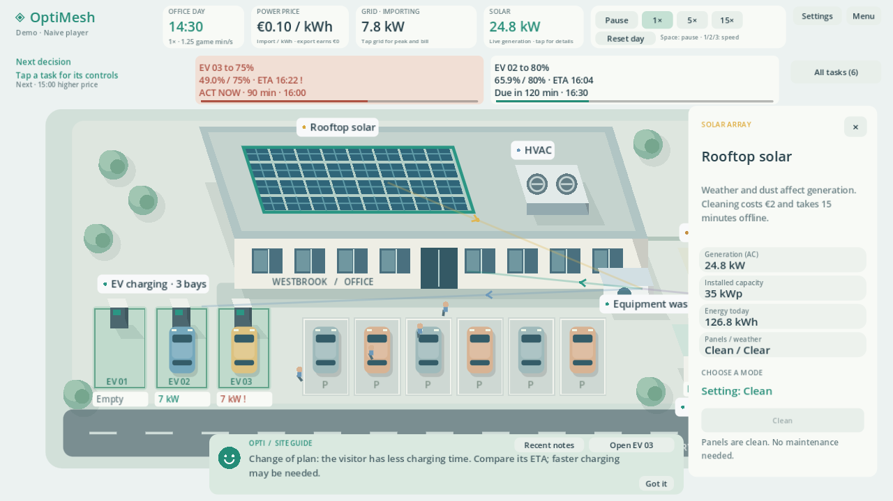
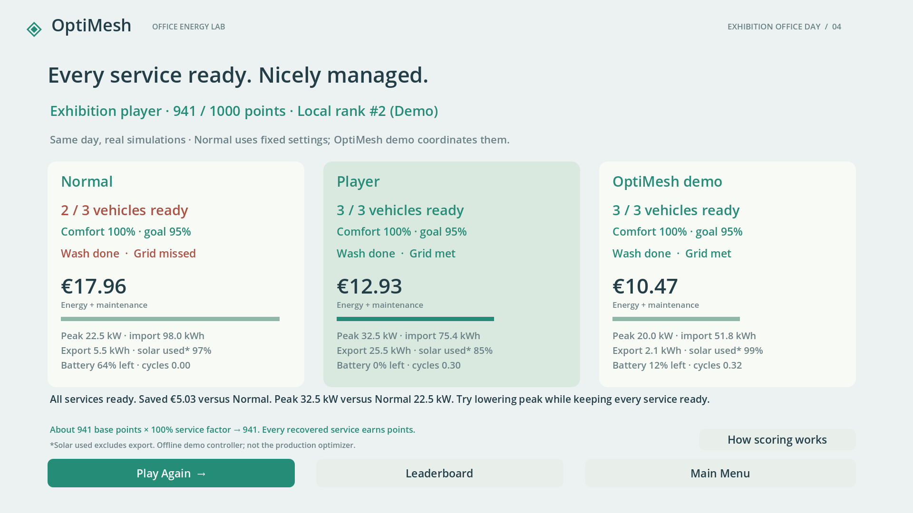

# OptiMesh Game

**Run an office. Balance its energy. See what coordinated management changes.**

## What is OptiMesh Game?

OptiMesh Game is the standalone interactive energy-management game and exhibition demo for the wider **OptiMesh** project. You manage a working office site through a day of changing demand, weather and deadlines, making the decisions that coordinated energy management is designed to handle.

| Project | Role |
|---|---|
| [OptiMesh Platform](https://github.com/Praz40/OptiMesh) | Main team project: dashboard, backend, firmware and platform documentation. |
| **OptiMesh Web Simulator** | Browser simulation within the main platform repository. |
| **OptiMesh Game** | This separate, offline Godot exhibition game. |

## Download and play

**For players and exhibition laptops**

[**Download the Windows x86_64 demo ZIP**](https://github.com/DGtao13/OptiMesh-Game/releases/download/v0.1.1-demo/OptiMesh-Game-v0.1.1-demo-windows-x86_64.zip) · [Release notes](https://github.com/DGtao13/OptiMesh-Game/releases/tag/v0.1.1-demo)

Extract the ZIP, open the extracted folder and run **`OptiMesh.exe`**. Keep `OptiMesh.pck` beside the executable. No Godot editor, backend or account is required. This exhibition build is a **pre-release** for Windows x86_64.

**For development**

Clone the repository, install standard **Godot 4.5+**, import `project.godot` in the Project Manager and press **F5**. The .NET edition and addons are not required. The optional Windows launcher is `./run.ps1 -GodotPath 'C:\Tools\Godot.exe'`. See [RELEASE.md](RELEASE.md) to reproduce the pinned Godot 4.5 stable Windows build.

## Gameplay

Manage **rooftop solar**, **battery storage**, **three EV chargers**, **HVAC comfort** and an **equipment wash**. Work around electricity prices, clouds, dirty panels, vehicle arrivals/departures and a temporary grid import limit. Charging a car faster may help its deadline while raising the site's peak; saving energy on cooling may compromise comfort.

**Opti**, your in-game colleague, introduces the site, highlights forecasts and risks, links you to the relevant controls and explains outcomes. Click tasks or equipment to act; pause whenever you need time to plan.

| Feature | What you experience |
|---|---|
| **Demo / Normal modes** | Approximately 8 / 20 minutes of running clock time, plus onboarding and pauses. |
| **Deterministic simulation** | Real power, energy and cost accounting shared by the player and comparison strategies. |
| **Events and deadlines** | EV arrivals, a changed departure, clouds, solar cleaning and the grid challenge. |
| **Services and efficiency** | Keep vehicles ready, rooms comfortable and flexible work complete while managing the bill and peak. |
| **Opti guidance** | Contextual advice, task controls, forecasts and recent notes for rereading. |
| **Score and local ranking** | Up to 1000 points; recovered services still earn points after mistakes. |
| **Living site** | Moving cars and pedestrians, changing daylight/weather and animated power flows. |
| **Offline audio and storage** | Original synthesized music/SFX, adjustable volume and local JSON settings/rankings. |

The exhibition menu adds quiet energy flows, moving clouds and a passing car; the gameplay ribbon shows two ranked tasks with simulated countdowns. [Usability findings and validation](USABILITY.md).

## Why it exists

The game makes energy-management tradeoffs visible and approachable. The player manages the site manually, then sees the **same scenario** simulated under three approaches: **Normal/default operation**, **the player's decisions**, and an **OptiMesh demo-reference strategy**.

The comparison demonstrates the value of coordinating services and energy use. The OptiMesh reference strategy is an illustrative simulation controller and is **not the production OptiMesh optimization engine**.

## Demo flow

**Enter a name → meet Opti → manage the office day → compare results → retry or check the leaderboard.**

Click a task or site object to open its inspector. **All tasks** retains completed/missed requirements; **Recent notes** pauses the day for rereading. Settings offer music/effects volume, a sound preview, mute and reduced ambient activity.

| Shortcut | Action |
|---|---|
| Space | Pause / resume |
| 1 / 2 / 3 | 1× / 5× / 15× speed |
| Esc | Close inspector or skip the introduction |
| F11 | Toggle fullscreen on every screen |

Name entry supports tap-to-focus and requests the system virtual keyboard where supported. Godot 4.5 on Windows does not expose that feature: open the Windows touch keyboard manually, or choose **Use Guest** to start without typing. Fullscreen is also available from the menu and Settings. Physical touchscreen validation is still required.

The leaderboard is local to the machine, retains the top 50 current-rule runs and displays ten. Exhibition administrators can reset it with **Ctrl+Shift+Delete** on that screen, then confirm.

## Technical overview

**Godot 4.5+ · GDScript · Compatibility renderer · lightweight 2D/2.5D site · deterministic simulation · local JSON persistence.**

Source is in `scripts/`, scenes in `scenes/`, and regression suites in `tests/`. Godot `.gd.uid` files are tracked script identifiers. Builds, runtime downloads, editor caches and validation captures stay outside the published source tree.

## Documentation

- [SIMULATION.md](SIMULATION.md) — energy model and accounting.
- [SCENARIO.md](SCENARIO.md) — events, devices, score rules and reference policies.
- [AUDIO.md](AUDIO.md) — synthesized audio and provenance.
- [VALIDATION.md](VALIDATION.md) — gameplay regression and rendered coverage.
- [POLISH_REVIEW.md](POLISH_REVIEW.md) — refinement issue log and playthrough outcomes.
- [RELEASE.md](RELEASE.md) — Windows export, packaging and exported-build checks.
- [PLAYTEST.md](PLAYTEST.md) — historical developer report, superseded by the current polish review.

## Status and validation

The game is ready for an **offline exhibition demo**, with both play modes, real strategy comparisons and local rankings. This Windows release is marked as a pre-release. Gameplay was reviewed at **1920×1080**, **1366×768** and **1280×720**; export-specific checks are recorded in [RELEASE.md](RELEASE.md).

The scenario, thermal model and solar-use metric are simplified for demonstration. Independent visitor feedback and sustained performance/audio checks on the actual exhibition laptop remain useful validation steps; detailed limits are in the linked reports.

For regression checks: `./Test-Prototype.ps1 -GodotPath 'C:\Tools\Godot.exe'`. Add `-Capture -Resolution 1366x768` for rendered captures; 1920x1080 and 1280x720 are also supported. Tests use separate stores from player rankings.

## Related project

Visit [**Praz40/OptiMesh**](https://github.com/Praz40/OptiMesh) for the main OptiMesh platform and its Web Simulator. This Godot game remains a separate repository and release.
